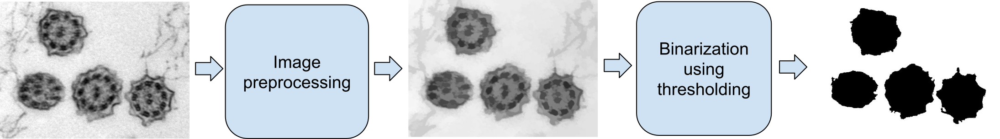

= Exercise 1: Image Processing and Enhancement

The student's task will be to load a given input image, display its histogram, and experiment with various adjustments of brightness and contrast using gamma transformation, histogram equalization, and the CLAHE method, so that the output image is visually enhanced and suitably prepared for simple binarization using thresholding (https://en.wikipedia.org/wiki/Otsu%27s_method[OTSU] method).

In the upcoming exercises, preprocessing methods will be extended by morphological processing and filtering.

For the evaluation of binarized objects, contour analysis will be used.

The student will submit the final solution in the form of a report. A complete and creative solution is expected, using the methods practiced during the exercises.

---

### Data

Download data (*.tif) for this assignment from link:https://gitlab.fit.cvut.cz/NI-PIV/ni-piv/-/tree/master/tutorials/files/Data[this directory].

### OpenCV

- OpenCV Documentation: https://docs.opencv.org/

- Recommended functions:

    * `imread()`
    * `calcHist()`
    * `equalizeHist()`
    * `pow()`
    * `createCLAHE()`
    * `findContours()`

### Implementation: 

- prog. language: C++ or Python
- for computer vision tasks it is required to use `OpenCV`
- recommended deep learning libraries: TensorFlow, PyTorch, or Keras
