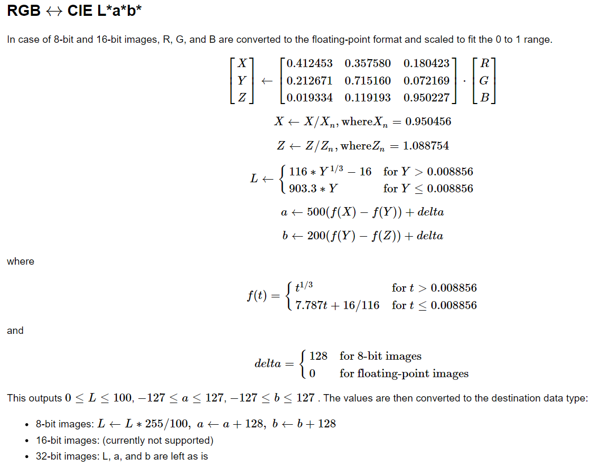
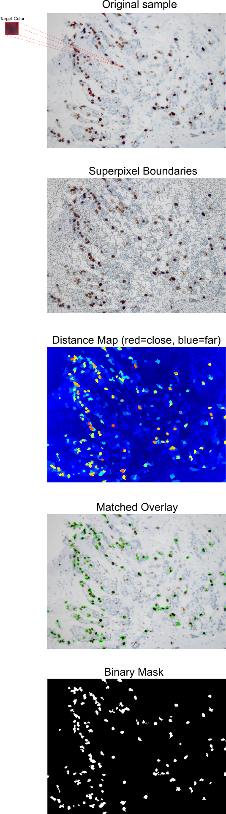

= Exercise 10: Superpixel-based Color Matching

Implement a pipeline that segments an image by detecting regions visually similar to a target color. 
For superpixel segmentation experiment with the following methods:

- `cv::ximgproc::SuperpixelSLIC` (**S**imple **L**inear **I**terative **C**lustering) 
- `cv::ximgproc::SuperpixelSEEDS` (**S**uperpixels **E**xtracted via **E**nergy-**D**riven **S**ampling)
- `cv::ximgproc::SuperpixelLSC` (**L**inear **S**pectral **C**lustering) 

For more information see link:https://docs.opencv.org/4.x/df/d6c/group\__ximgproc__superpixel.html[OpenCV Documentation].

---

## Data

Download data for this assignment from link:https://gitlab.fit.cvut.cz/NI-PIV/ni-piv/-/tree/master/tutorials/files/Data-Superpixels[this directory], where:

- `Sample_color.bmp` is the target color image for histology samples 1 and 2
- `TCGA-50-5931-01Z-00-DX0.tif` (histology sample image 1)
- `TCGA-50-5931-01Z-00-DX1.tif` (histology sample image 2)
- `stainski67Roychowdhury03.jpg` (additional sample - create custom target color image)

## Implementation Details

To use OpenCV for superpixel segmentation (SLIC, SEEDS, LCS) install appropriate packages: 

- `pip install opencv-contrib-python`

### Task 

1. Reference color extraction

- load a small sample color image (`Sample_color.bmp` for `TCGA-*.tif` histology images), or create a custom one
- convert to L*a*b*
- compute average L*a*b* vector of the sample 

2. Superpixel segmentation

- load a histology image (e.g., `TCGA-*.tif`)
- convert to L*a*b*
- apply superpixel segmentation (e.g., SLIC, SEEDS, LCS)
- experiment with segmentation methods and their parameter values

3. Color similarity

- for each superpixel:
  - compute mean L*a*b*
  - compute euclidean L*a*b* distance to the sample mean 
- select superpixels with ΔL2 distance < threshold (choose suitable value)

4. Visualization

- outline the selected superpixels on the _original image_ + highlighted superpixels
- optionally, generate a distance heatmap image (normalize for visibility)

IMPORTANT: Beware of RGB ↔ L*a*b* conversion and numerical representation (ensure `float32`). For more details, see link:https://docs.opencv.org/3.4/de/d25/imgproc_color_conversions.html#color_convert_rgb_lab[OpenCV documentation].

//

---

## Example pipeline for _SEEDS_ superpixel segmentation

