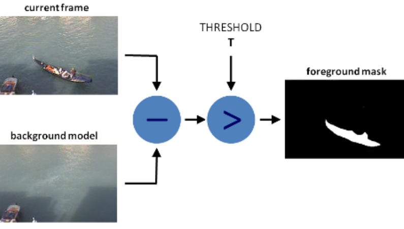
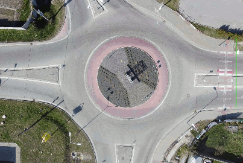
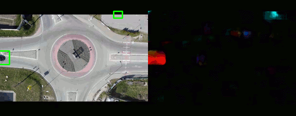

# Exercise 11: Motion and Tracking

This exercise focuses on fundamental techniques in computer vision for analyzing _motion_ in video sequences. Your task is to implement and compare methods for segmenting moving foreground objects from a static background and subsequently track object movement using optical flow techniques (sparse and dense flow).

TIP: Use `OpenCV` and `NumPy` libraries (for Python).

## Data

Use a video file featuring a static camera and multiple objects moving across the scene. Feel free to experiment with multiple videos. You can download video data from link:https://motchallenge.net/data/MOT15/[MOT15 benchmark] (or use any other appropriate videos). 

NOTE: For your experiments pick up at least 2 different videos with static camera and multiple objects presented in the screen, moving different paths, crossing or moving close to each other.

---

## Task 1: Segmentation using Background Subtraction

Use background subtraction methods to properly segment the moving objects from their background. Use one of the videos with static camera.

[.text-center]

Use the following approaches:

- Accumulated Weighted Average: `cv2.accumulateWeighted()`
- Mixture of Gaussian (MOG2): `cv2.createBackgroundSubtractorMOG2()`
- optionally implement your _own custom accumulator_ matrix using your _own_ idea (math can be simple, moving average, median, ...)

    * weighted moving average formula: `BG_new = (1 - ALPHA) * BG_old + ALPHA * CurrentFrame`

TIP: To improve mask qulity and reduce noise apply _preprocessing_ (Grayscale conversion and Gaussian Blur) and _postprocessing_ (Dilation).

**Goal:** Visualize the background image and at given time frame also the foreground moving object of interest. Visually compare the approaches.

## Task 2: _Sparse_ Optical Flow (feature tracking)

The objective is to use Sparse Optical Flow (**Lucas-Kanade method**) to track a limited set of keypoints across the video sequence, visualizing their trajectories.

[.text-center]

**Feature Detection:** Use `cv2.goodFeaturesToTrack()` (Shi-Tomasi corners) to detect initial points of interest.

**Feature Tracking:** Use `cv2.calcOpticalFlowPyrLK()` to calculate the movement of these points between successive frames.

**Trajectory Visualization:** Draw the track history (line segments) and the current location (circle) of each successfully tracked feature point.

NOTE: Optional Task: _Identify each object using a bounding box and count them. (For example when they cross a drawn line)_.

Consider the following real-world challenges and try to address them (document how you proceeded to solve each of these issues):

- Objects do not need to be present in the scene from the start, and can arrive later -> _How do you detect those objects and start tracking them?_
//(Hint: Re-run cv2.goodFeaturesToTrack() periodically and update your point list).
- Feature points for tracking depending on the method for feature detection can be duplicates and tracking the same points is computationally expensive -> _How do you make sure to not detect or track duplicate features?_
- Features might not be considered good for tracking (they can be stationary or object can leave the scene) -> _How do you pick which features are worth tracking?_
//(Hint: Use the status array returned by calcOpticalFlowPyrLK).

**Goal:** Visualize trajectories of moving objects.

## Task 3: _Dense_ Optical Flow (motion tracking)

The objective is to use Dense Optical Flow (**Farneback method**) to identify general motion areas across the entire frame and enclose moving objects with bounding boxes.

[.text-center]

**Flow Calculation:** Use `cv2.calcOpticalFlowFarneback()` to compute the optical flow vector for every pixel.

**Motion Mask:** Convert the flow vectors to magnitude (speed) and apply thresholding to create a binary mask representing all moving areas.

**Object Bounding:** Use `cv2.findContours()` and `cv2.boundingRect()` on the motion mask to draw a rectangle around each significant area of motion.

TIP: See also link:https://docs.opencv.org/master/d4/dee/tutorial_optical_flow.html[OpenCV tutorial] on optical flow.

Mark each moving objects with bounding box. Find in your dataset a scene, where objects are moving close to each other or passing through each other. Can you minimize the issue of detecting these objects as one? Document your approach where you try to distinguish if two objects are coliding while still being able to draw two separate bounding boxes (or one bounding box with different color) for objects, separating them.