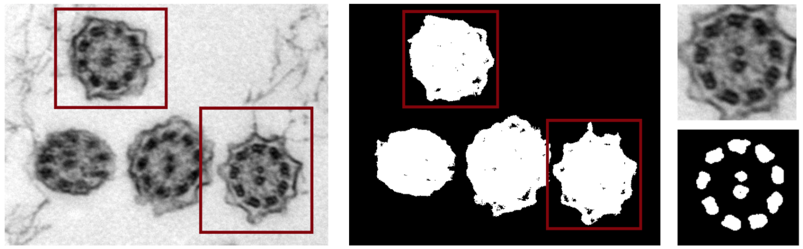
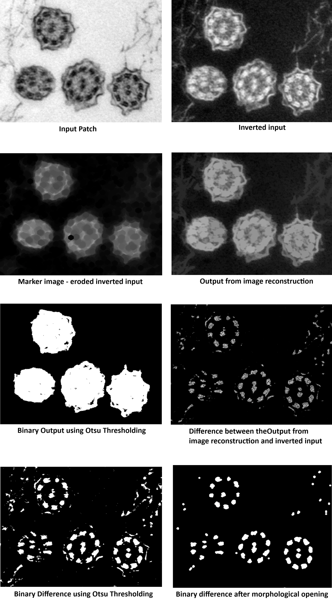
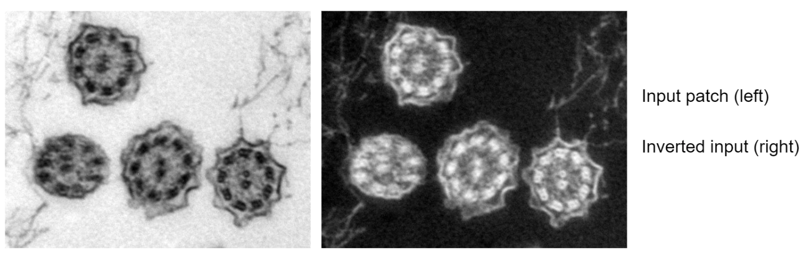
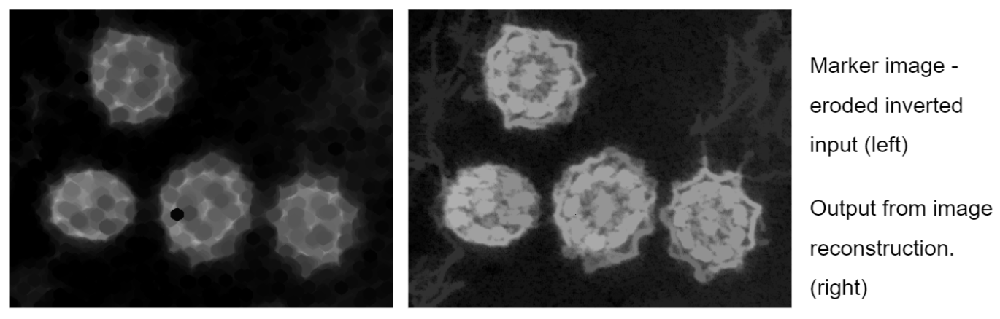
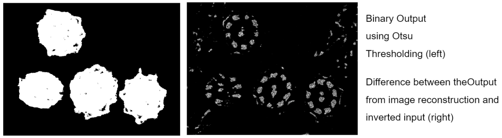
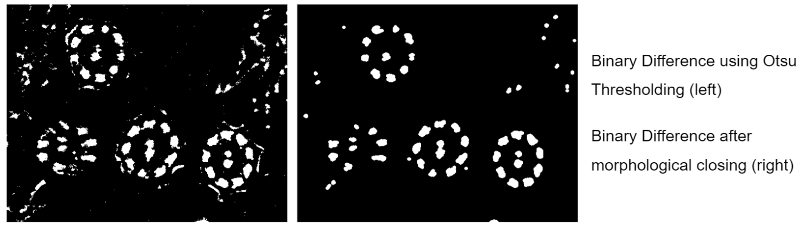

= Exercise 2: Morphological Image Reconstruction




The goal of the second exercise is to experiment with the use of various *morphological* operations, with a particular focus on **Morphological Image Reconstruction**. (The Python code for the `image_reconstruct` function can be found in this document.)

The final goal of the **1. Assignment PIV** is to create a dataset of microscope images of PCD (primary ciliary dyskinesia) consisting of patches extracted from the original PCD image, where each patch corresponds to the bounding rectangle of a single cilium.
The next step is then creation of a binary mask for the segmentation of microtubules within each cilium and to count them. For the binarisation, the Otsu thresholding (param: `THRESH_OTSU`) could be used.

```python 
import cv2
import numpy as np
from collections import deque


class Pixel:
   def __init__(self, row, col):
       self.row = row
       self.col = col


def image_reconstruct(marker: np.ndarray, mask: np.ndarray) -> np.ndarray:
   """
   Perform morphological reconstruction by dilation.

   Parameters:
       marker (np.ndarray): The marker image (seed).
       mask (np.ndarray): The mask image (constraint).

   Returns:
       np.ndarray: Reconstructed image.
   """
   if marker.shape != mask.shape:
       raise ValueError("Marker and mask must have the same dimensions")

   # Ensure images are in the same type
   marker = marker.astype(mask.dtype)

   # Create a working copy
   reconstructed = marker.copy()

   # Use a queue for pixels to update
   q = deque()
   rows, cols = reconstructed.shape

   # Initialize queue with pixels where marker < mask
   for r in range(rows):
       for c in range(cols):
           if reconstructed[r, c] < mask[r, c]:
               q.append(Pixel(r, c))

   # Neighbor offsets (4-connectivity)
   neighbors = [(-1, 0), (1, 0), (0, -1), (0, 1)]

   while q:
       p = q.popleft()
       for dr, dc in neighbors:
           rr, cc = p.row + dr, p.col + dc
           if 0 <= rr < rows and 0 <= cc < cols:
               new_val = min(mask[rr, cc], max(reconstructed[rr, cc], reconstructed[p.row, p.col]))
               if new_val > reconstructed[rr, cc]:
                   reconstructed[rr, cc] = new_val
                   q.append(Pixel(rr, cc))

   return reconstructed
```

---

# Example pipeline:



////




////

