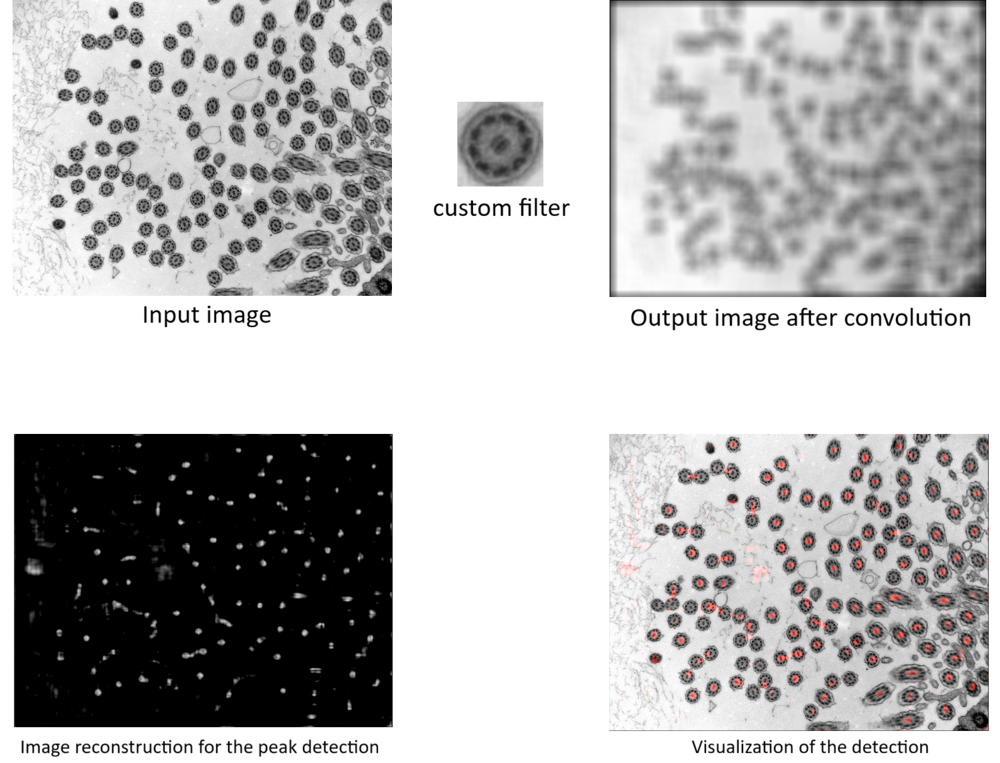

= Exercise 3: Image Filtration

The goal of the third exercise is to experiment with the use of various types of filters — *blur* and *edge* filters, including *DoG (Difference of Gaussians)* and *LoG (Laplacian of Gaussian)* — using various filter kernel sizes. Consider applying these filters as part of your image preprocessing pipeline, for example, to *reduce noise* in images.

Next, students should also experiment with the *bilateral filter* and the *Canny edge detector*, and consider how these methods could be used in their own project solutions.

Students will also design their *own filter kernel* for cilium detection using convolution or cross-correlation.

## Example

