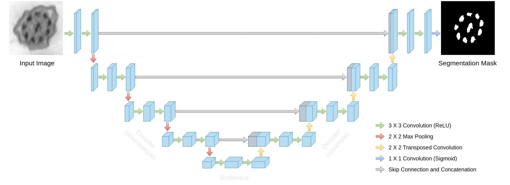
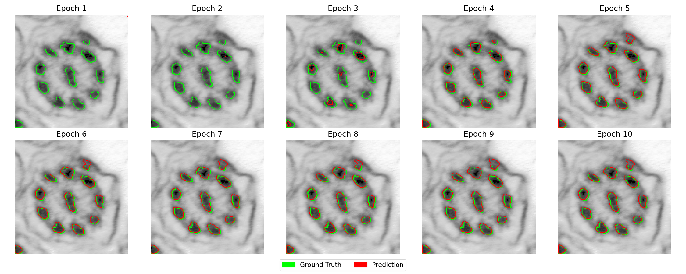
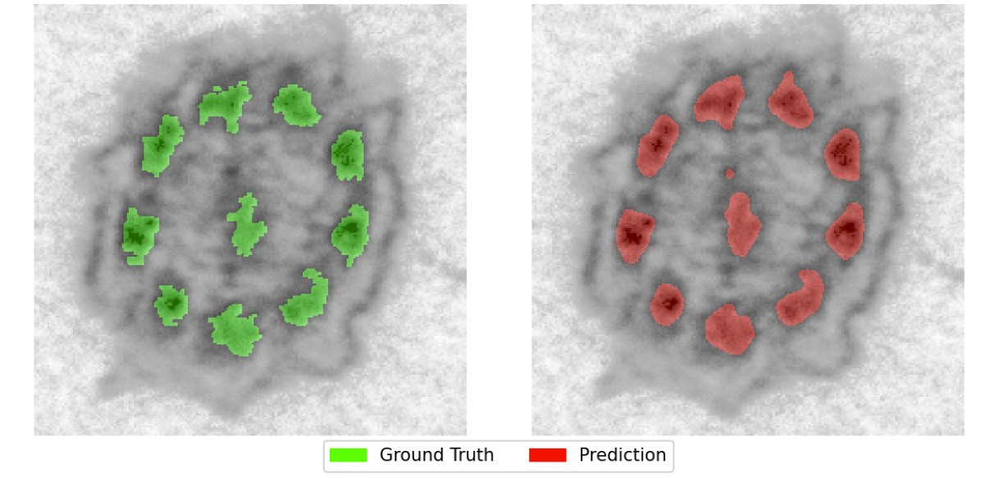
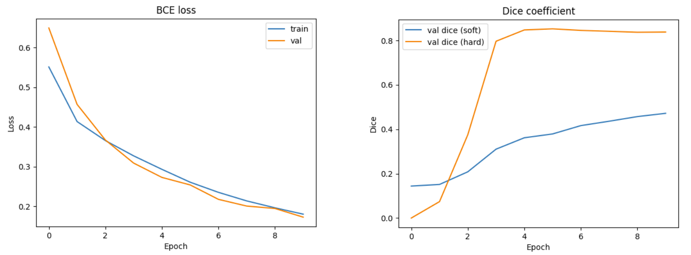

= Exercise 4: U-Net Segmentation

In this exercise, you will use the *dataset* of cilia microscopy images and their corresponding tubule segmentation masks that you created in the previous exercises, as a part of xref:../Assignments/assignment-1.adoc[Assignment 1].  
Your task is to train and evaluate a simple **U-Net neural network** that can automatically segment the tubules from microscopy images.



TIP: Check the official PyTorch link:https://docs.pytorch.org/tutorials/beginner/basics/quickstart_tutorial.html[Quickstart tutorial] for help.

== Dataset Preparation
You should already have pairs of files, e.g.:

* `img_X.png` – microscopy image (input)
* `img_X_mask.png` – binary segmentation mask (output)

Keep your image-mask pairs in an organized structure, e.g.:
```
data/
├── images/
│   ├── img_001.png
│   ├── img_002.png
│   └── ...
└── masks/
    ├── img_001_mask.png
    ├── img_002_mask.png
    └── ...
```

Prepare a PyTorch link:https://docs.pytorch.org/docs/stable/data.html#torch.utils.data.DataLoader[DataLoader] for your data:

* read *grayscale* images
* resize images to a *fixed size* (e.g, 128x128, or 256x256)
* *normalize* (0-1 range)
* masks are *binary* (0 = background, 1 = tubule)
* split the dataset into *training* (~80%) and *validation* (~20%) subsets
* *data augmentation* to extend the training set (horizontal/vertical flip)

*Example Template*
```python
### Step 1: Dataset
class CiliaDataset(torch.utils.data.Dataset):
    def __init__(self, pairs, img_size=256):
        self.pairs = pairs
        self.img_size = img_size

    def __len__(self):
        return len(self.pairs)

    def __getitem__(self, idx):
        # TODO: load image + mask, resize, normalize + data augmentation
        return img_tensor, mask_tensor

# TODO: implement function to split into train/val sets
```

TIP: Check also link:https://docs.pytorch.org/tutorials/beginner/basics/data_tutorial.html[Datasets & DataLoaders] and link:https://docs.pytorch.org/tutorials/beginner/basics/transforms_tutorial.html[Data Transforms] PyTorch tutorials.


== U-Net Segmentation Model
It's a special type of convolutional neural network (CNN) designed for *segmentation*.

* **Encoder** (downsampling): reduces image size step by step, while learning features.
* **Decoder** (upsampling): upsamples back to original size.
* **Skip connections**: connect encoder and decoder to keep the details.

Your task will be to *build your own U-Net model architecture* in PyTorch (or other favorite framework).

*Example Template*
```python
### Step 2: U-Net model
class UNet(nn.Module):
    def __init__(self):
        super().__init__()
        # TODO: define encoder, decoder, skip connections

    def forward(self, x):
        # TODO: implement forward with skips
        return logits
```

TIP: Check the Pytorch link:https://docs.pytorch.org/tutorials/beginner/basics/buildmodel_tutorial.html[Build the Neural Network] tutorial.

== Model Training

* **Loss function**: Binary Cross Entropy with logits (`BCEWithLogitsLoss` in PyTorch)
* **Optimizer**: Adam, learning rate = 0.001
* **Metrics**:
** Training and validation loss
** Dice coefficient (measure of segmentation quality)

*Example Template*
```python
### Step 3: Training loop
model = UNet()
optimizer = torch.optim.Adam(model.parameters(), lr=1e-3)
loss_fn = nn.BCEWithLogitsLoss()

for epoch in range(num_epochs):
    model.train()
    for imgs, masks in train_loader:
        # TODO: forward → loss → backward → step
        # 1. Forward pass: compute predicted mask
        # 2. Compute loss: how far are predictions from GT
        # 3. Backpropagation: compute gradients
        # 4. Update model parameters (optimizer.step())
        pass

    model.eval()
    # TODO: compute validation loss + Dice
```
== Visualizations
To better understand the model behavior, plot the *training & validation loss* curves, and *dice coefficient* values. You can also plot the final overlay of the U-Net's predicted mask and compare it to the ground truth mask.

---

*Evolution of model prediction mask* during training



---

*Comparison of GT mask vs. final predicted mask*



---

*Learning curves (train, valid.) and dice scores (hard, soft)*



---

NOTE: To better understand intermediate feature maps of a trained U-Net, check also link:https://simonsmida.github.io/unet-demo/[this interactive demo].