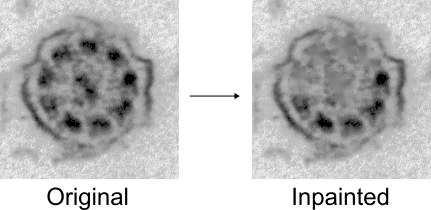

# Exercise 7: CNN Classification

Image classification task (2 classes: original cilia vs. inpainted) using CNN (custom vs. pretrained).

```
image -> CNN -> pred_class
```

### Dataset Preparation

In this exercise, your task is to create a slightly new dataset, containing original cilia images and corresponding link:https://docs.opencv.org/3.4/df/d3d/tutorial_py_inpainting.html[inpainted] alternatives. This will represent 2 distinct classes - *original* and *inpainted* - which will be classified by a CNN. 

For tubule inpainting you can use link:https://docs.opencv.org/3.4/df/d3d/tutorial_py_inpainting.html[OpenCV inpaint].



Prepare the dataset for classification task (2 classes: original & inpainted).

NOTE: Experiment with the inpainting options - inpainting just 1 tubule might be too difficult for the model to learn!

### Custom CNN model

Follow these steps:

- design your *custom* classification *model architecture* (e.g., CNN - feature extractor and classifier)
- *train* the model (train/valid/test split)
- *evaluate* the model 


### Using Pretrained Models (Transfer Learning)

PyTorch offers multiple pretrained models that can be used as a link:https://www.ultralytics.com/glossary/backbone[backbone].

Example of loading `resnet18` model pretrained on ImageNet:

```python
import torchvision.models as models

model = models.resnet18(weights=models.ResNet18_Weights.IMAGENET1K_V1)
```

To work with the pretrained model replace the final classification layer (ImageNet has 1000 classes, we only have 2).

Then, for the model training, you have two options:

- 1. Freeze feature extractor, or
- 2. Fine-tune entire model 

TIP: Check link:https://docs.pytorch.org/vision/main/models.html[PyTorch documentation] for more info.
