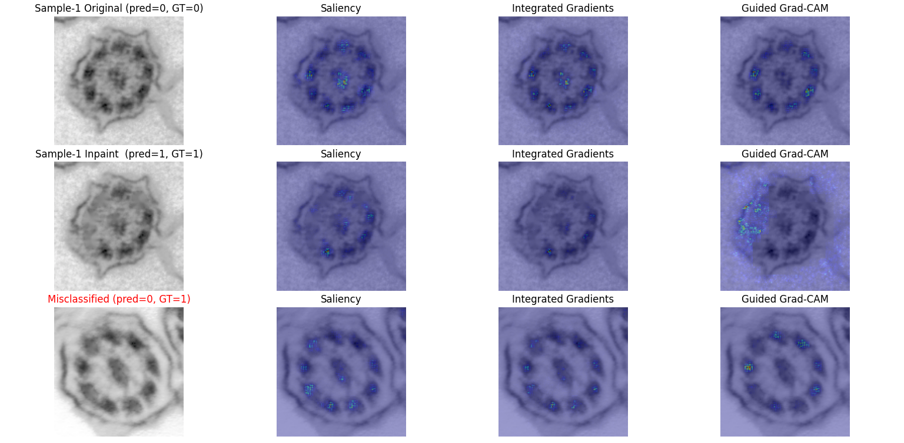

# Exercise 8: CNN interpretability

This exercise directly follows the results from xref:exercise-7.adoc[Exercise 7].

Experiment with various attribution methods to analyze the decision processes of the trained model.

TIP: Use link:https://captum.ai/[Captum] model interpretability library for PyTorch.

Example XAI methods from link:https://captum.ai/api/attribution.html[Captum] library: `Saliency`, `Integrated Gradients`, `Guided Grad-CAM`, ...

### Example attribution maps

