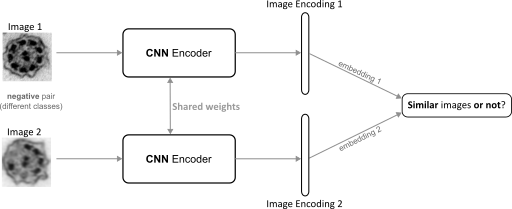
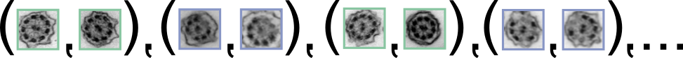
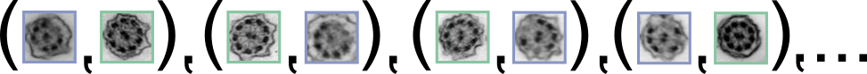
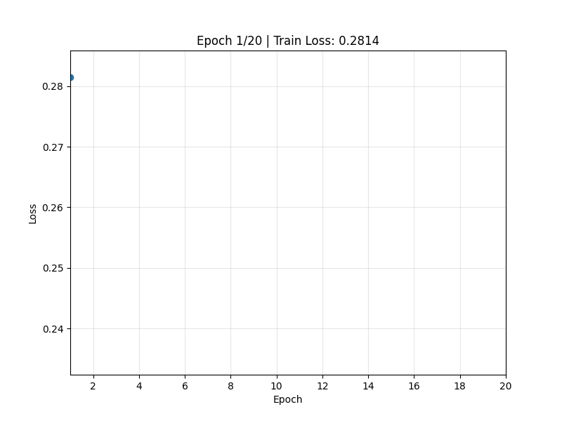
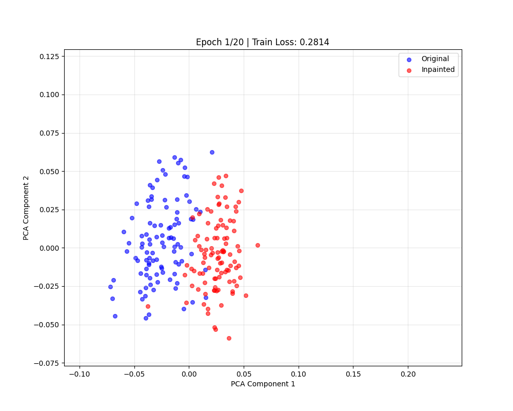
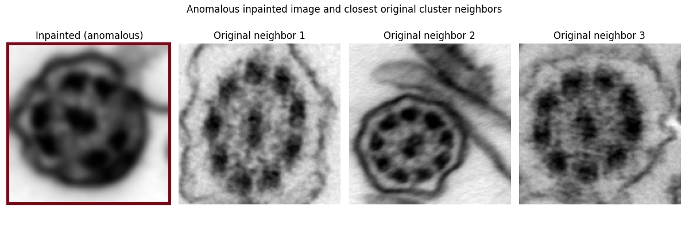

= Exercise 9: Siamese Networks for Image Similarity

[.text-center]

=== Dataset 

As previously, divide the dataset into _training_ and _validation_ subsets (optionally, test set). The dataset should contain both *original* and *inpainted* samples of cilia (same as in xref:exercise-7.adoc[Exercise 7]). For the model training, ensure appropriate data loading (according to the selected loss function). For link:https://medium.com/data-science/contrastive-loss-explaned-159f2d4a87ec[**contrastive loss**], consider:

* **Positive** pairs (similar): images from the same class, considered either original-original, or inpaint-inpaint

[.text-center]

* **Negative** pairs (_not_ similar): images across the classes, original-inpainted

[.text-center]

Each image pair `(image₁, image₂)` is assigned a `label`: 

* `label = 1` → similar (positive)
* `label = 0` → not similar (negative)

Usage in *supervised* learning: `loss = contrastive_loss(image_emb₁, image_emb₂, label)`

=== Task

Design and train a *Siamese network* (two CNN branches with _shared_ weights):

- *Inputs:* image pair

- *Output:* similarity score (distance between embeddings)

Experiment with the loss functions (e.g., link:https://medium.com/data-science/contrastive-loss-explaned-159f2d4a87ec[**contrastive loss**], link:https://medium.com/analytics-vidhya/triplet-loss-b9da35be21b8[triplet loss], ...)

*Goal:* The network should learn to embed similar images close together and dissimilar images far apart, based on pairwise similarity supervision.

* similar pairs → small distance 
* not similar pairs → distance ≥ margin

---

### Optional: Embedding Space Visualization (projection to 2D)

You can view the learned embedding space by projecting then using link:https://scikit-learn.org/stable/modules/generated/sklearn.decomposition.PCA.html[PCA] or link:https://scikit-learn.org/stable/modules/generated/sklearn.manifold.TSNE.html[t-SNE] to verify clustering of similar samples.

[.text-center]
 

The projection might be helpful to inspect **anomalous examples**: 

