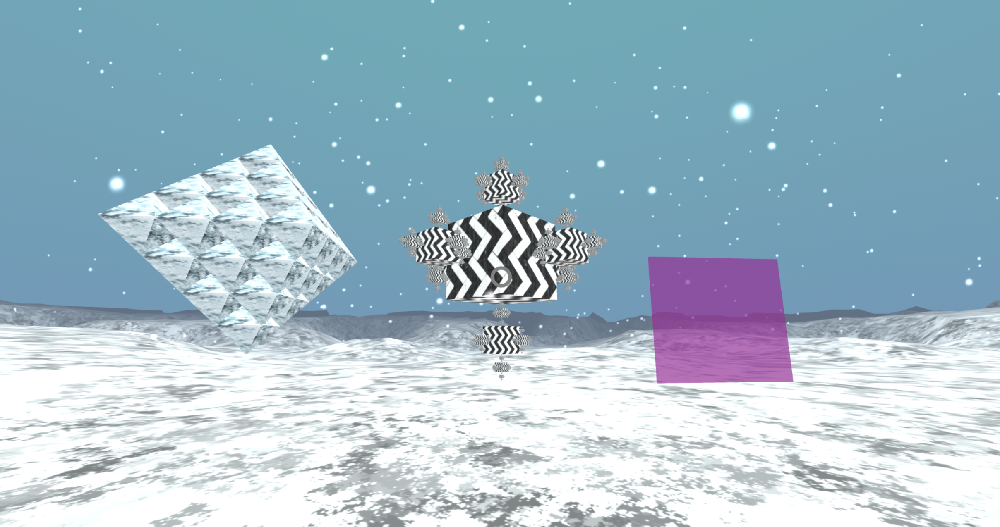

/A-Frame:error This HTML file is currently being served via the file:// protocol. Assets, textures, and models WILL NOT WORK due to cross-origin policy! Please use a local or hosted server: https://aframe.io/docs/0.5.0/introduction/getting-started.html#using-a-local-server.

# 3D Fractals VR and AR
Webová aplikace kombinující VR & AR v prohlížeči pomocí JS knihoven A-Frame a AR.js.

[>Play the video demo](https://youtu.be/nV8y-x6LvtY)

## Uživatelská dokumentace
Aplikace je čistě ve webovém prohlížeči, tedy stačí mít chrome/edge/jiný a není potřeba nic doinstalovávat.
Nejdříve se obejvíte ve VR, které se dá ovládat myší a šipkami.
Pokud kurzorem namíříte na fialový portál svět se přepne do AR módu, 
kde si můžete na Kanji a Hiro markery zobrazit fraktály z předchozí scény.
Z AR se můžete vrátit pomoví ESC.

- ESC - zpět z AR
- myš a šipky nebo WASD - pohyb ve VR

## Programátorská dokumentace

Nápad byl takový, že udělám přepínání mezi VR a AR, ale po chvili jsem zjistil, že to není tak jednoduché.
Schovat scénu ani importovat AR knihovnu v jiné části souboru nefungovalo a vždy se mi misto VR zapla kamera.
A jako jediné funkční řešení jsem objevil vytvoření VR scény a následné vytvoření html kódu pro AR scénu, který 
importuje AR.js do kódu. Ale nakonec se povedlo i s velkou neznalostí javascriptu.

Vývoj a vizualní debugging jsem dělal pomocí platformy glitch.com

### Knihovny

**AFrame webXR 1.2, aby byla vhodně kompatibilní s AR.js:**

1.2.0/aframe.min.js

**AR js 2.2:**

2.2.0/aframe/build/aframe-ar.min.js

**Doplňkové knihovny pro AFrame:**

aframe-particle-system-component.js

aframe-environment-component.min.js

