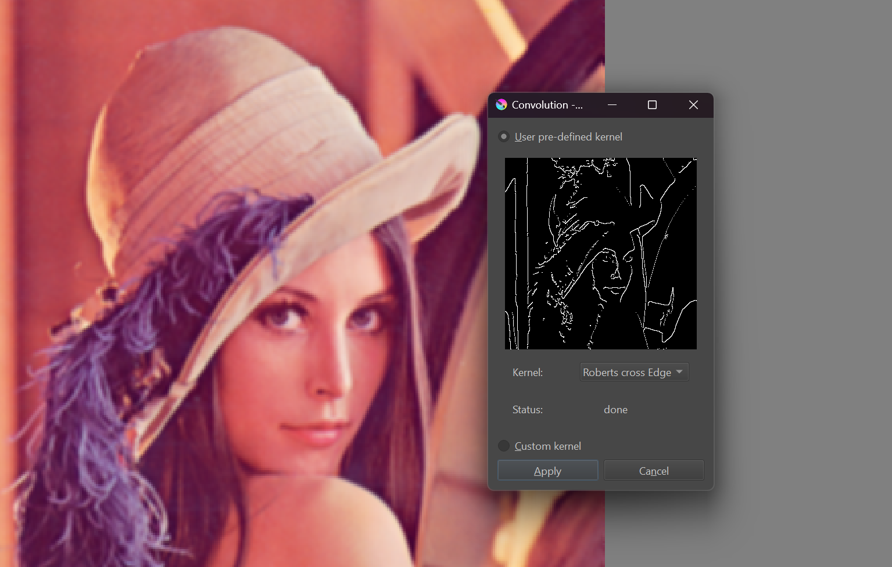
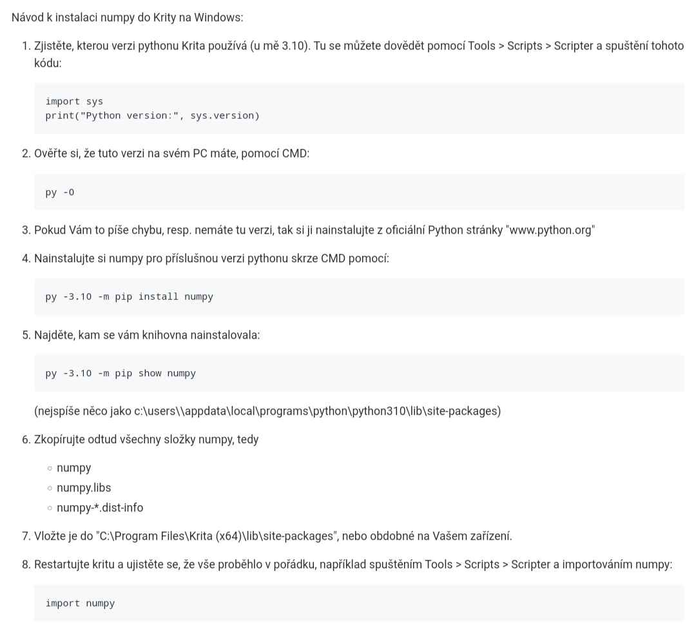
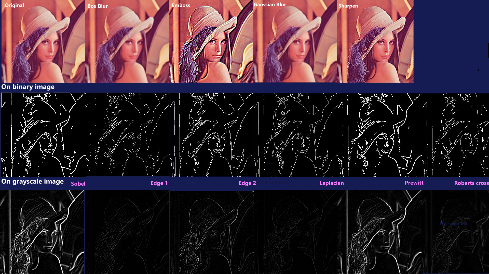

# 2D: Konvoluce

Zásuvný modul do Krity, ve kterém má uživatel na výběr několik kernelů i detektorů hran nebo může vložit vlastní kernel.




## Uživatelská dokumentace pro Windows

pozn. funguje na .png a RGBA obrázky

1. Vložte obsah src/ na Windows do \[disk\]:\Users\\[user]\AppData\Roaming\krita\pykrita 
2. Nainstalujte si numpy do Krity např. pomoci návodu od @janprochazka

3. V Kritě zapněte modul convolution: Nastavení > Nastavení aplikace Krita > Správce modulů Python
4. Restartujte Kritu
5. Nástroje > Convolution

## Výsledky



## Teoretická a programátorská dokumentace

1. uživatel vybere/vyplní kernel přes pyQt UI
2. okraje jsou rozsireny o nejbližší pixel obrázku
3. pokud se jedná o detekci hran, použije se kernel na grayscale obrázek, jinak na RGBA (alpha kanal se nastavi na nepruhledny)
4. výpočet konvoluce a update preview
5. aplikace/zrušení konvoluce

### Použité kernely
```python
self.kernels = {
            "Gaussian blur": np.array([[1, 2, 1], [2, 4, 2], [1, 2, 1]]) / 16,
            "Box blur": np.ones((3, 3)) / 9, 
            "Emboss": np.array([[-2, -1, 0], [-1, 1, 1], [0, 1, 2]]),
            "Sharpen": np.array([[0, -1, 0], [-1, 5, -1], [0, -1, 0]]),
            "Laplacian Edge": np.array([[0, 1, 0], [1, -4, 1], [0, 1, 0]]),
            "Edge 1": np.array([[1, 0, -1], [0, 0, 0], [-1, 0, 1]]),
            "Edge 2": np.array([[-1, -1, -1], [-1, 8, -1], [-1, -1, -1]]),
            "Roberts cross Edge": [np.array([[1, 0], [0, -1]]), np.array([[0, 1], [-1, 0]])],
            "Sobel Edge": [np.array([[1, 0, -1], [2, 0, -2], [1, 0, -1]]), np.array([[1, 2, 1], [0, 0, 0], [-1, -2, -1]])],
            "Prewitt Edge": [np.array([[1, 0, -1], [1, 0, -1], [1, 0, -1]]), np.array([[1, 1, 1], [0, 0, 0], [-1, -1, -1]])]
        }
```

### Dikrétní 2D konvoluce
```python
        enlarged_image = self.enlarge_image(image, kernel.shape[0] // 2)
        convolved_image = np.copy(image)
        for i in range(self.RGBA8888_channels):
            if gray and i == 3:
                break
            for y in range(self.height):
                for x in range(self.width):
                    sum = np.sum(kernel * enlarged_image[y:y + kernel.shape[0], x:x + kernel.shape[1], i])
                    convolved_image[y, x, i] = np.clip(sum, 0, 255)
```

### Řešení okrajů
pomocí kopírování nejbližšího pixelu
```python
        pixel_cnt = (kernel_half_size, kernel_half_size)
        res = np.pad(image, (pixel_cnt, pixel_cnt, (0, 0)), mode="edge")
```

### Kernely na grayscale obrazcích
```python
        grayscale_img = np.average(self.np_image[:, :, :3].astype(float), weights=[0.299, 0.587, 0.114], axis=2).astype(np.uint8)
        # oriznuti pro binarni image: bin_img = np.where(grayscale_img < 128, 0, 255)
        self.grayscale_np_image = np.zeros_like(self.np_image)
        self.grayscale_np_image[:, :, :3] = np.stack([grayscale_img] * 3, axis=-1)
        self.grayscale_np_image[:, :, 3] = 255
        convolved_image = self.convolution(kernel, gray, self.grayscale_np_image)
```
#### Horizontální a vertikální kernely

```python
        gradient_x = self.convolution(kernel[0], gray, self.grayscale_np_image, True)
        gradient_y = self.convolution(kernel[1], gray, self.grayscale_np_image, True)
        gradient_magnitude = np.sqrt(gradient_x.astype(np.float32)**2 + gradient_y.astype(np.float32)**2)
        gradient_magnitude = np.clip(gradient_magnitude, 0, 255).astype(np.uint8)
```
