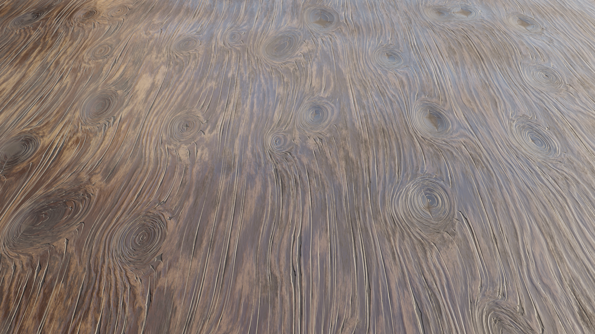
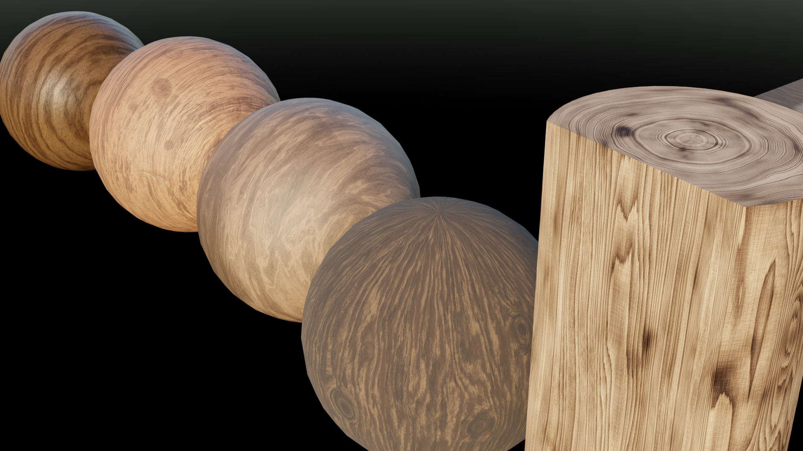
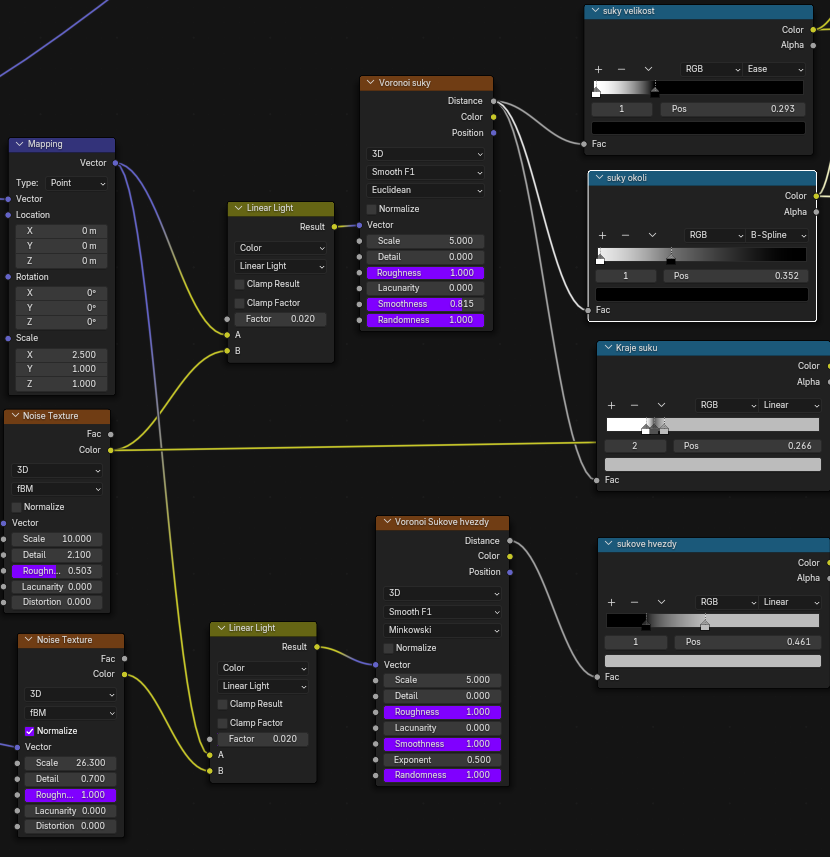
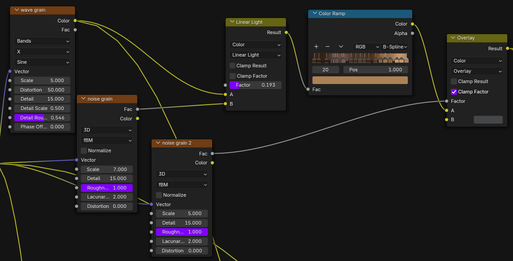
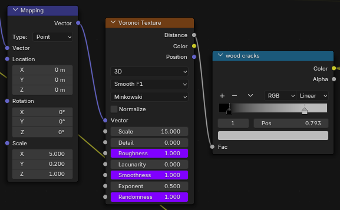
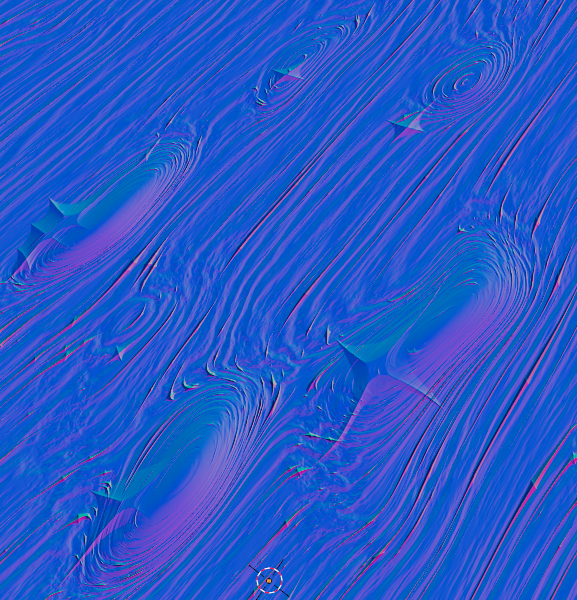
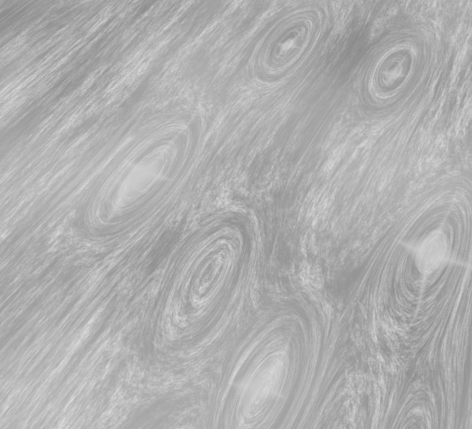

# 3D: Procedurání materiál dřeva

Plugin do Blenderu pro práci s materiálem dřeva.

## Uživatelská dokumentace

1. Složku wood.zip nahrajte jako add-on do Blenderu a zkontrolujte, že je zapnutý
2. přepněte do Shading
3. CRTL+A: add->Wood
4. Wood materiál se přidá mezi materiály

## Příprava na rozšíření

## Teoretická dokumentace

**Minkowského vzdálenost**

Je metrika v normovaném vektorovém prostoru, která může být považována za zobecnění jak euklidovské vzdálenosti, tak Manhattanovy vzdálenosti.

Minkowského vzdálenost v pořadí p (kde p je celé číslo) mezi dvěma body:

Exponent 0.5:

**Wave texture**

Textura vlny přidává procedurální pruhy nebo kruhy zkreslené šumem.

**Noise texture**

Textura šumu vyhodnocuje fraktální perlinový šum na souřadnicích vstupní textury. Perlinův šum je nejčastěji implementován jako dvou-, tří- nebo čtyřrozměrná funkce, ale může být definován pro libovolný počet dimenzí. Implementace obvykle zahrnuje tři kroky: definování mřížky náhodných vektorů přechodu, výpočet bodového součinu mezi vektory přechodu a jejich posuny a interpolaci mezi těmito hodnotami.

**Voronoi texture**

Voroného textura vyhodnocuje Voroného šum v bodě souřadnic vstupní textury. Voroného šum je rozšířením Voroného diagramu, jehož výstupem je skutečná hodnota na dané souřadnici, která odpovídá vzdálenosti n-tého nejbližšího **n** (obvykle n=1) a **n** jsou rovnoměrně rozložena v regionu.

## Programátorská dokumentace

### Suky a jejich praskliny/hvězdy

-   Suky:
Mapping node roztahuje UV souřadnice na **x** a pomocí linear light se v minimálním poměru kombinuje s noisem, aby suky, které vzniknou Voroného šumem, měly nepravidelné tvary. 
    -   Color ramp
        -   velikost suku: černá ovlivňuje
        -   okolí suku: černá určuje jak moc bude Voroného buňka zaplněna bílou barvou a to mění vzhled okolí suku
        -   kraje suku: černá ovlivňuje jak moc od středu buňky voroného diagramu bude okraj suku a bílé řeší fading okrajů dovnitř a ven

-   Hvězdy:
Jsou tvořeny hodně podobně, jen je vstup Voroného textury tvořen jiným noisem a je založen na Minkowského vzdálenosti, který vytváří tvar hvězdy. 
    -   Color ramp: černá ovlivňuje velikost vniřní části a bílá vnější části hvězdy

### Dřevěná textura

Z naškálovaných UV souřadnic zkombinovaných se suky jsou vytvořeny jeden wave texture, dva lehce jiné noisy a jeden voronoi texture. 
Wave texture vytváří texturu dřeva a s ní nakombinujeme noise, který dělá kartáčovitý detail na dřevě. Následně je to obarveno Color ramp,
 jejíž barvy jsou převzaty z reálné předlohy. 
Výsledek je v místech dřevených vláken spojen s šedou barvou, jež dělá druhou úroveň detailu. 

Voroného šum s Minkowského vzdálenosti dává za vznik nepravidelným kopiím dřevěných vláken, které představují praskliny mezi nimi.

### Normálová mapa

### Roughness mapa

