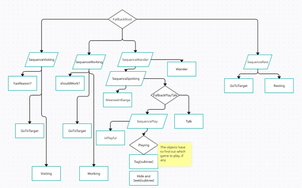
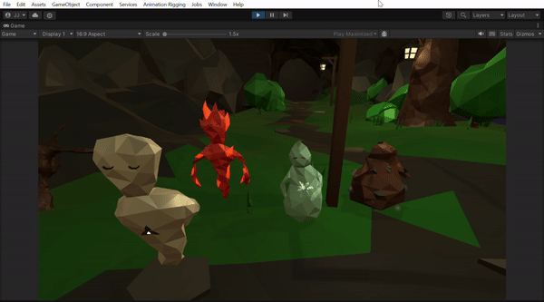
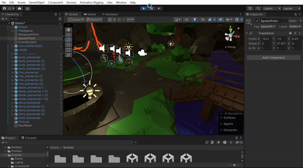
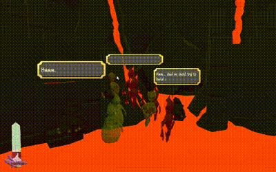

# Postavy:

### Old man Leede
Nejstarší Meenee, hlava vesnice. Od pohledu není jasné, který živel ovládá.

### Aquid Monopole
 Vodní Meenee, obchodník, prodává nové itemy ve svém obchodě. 
### Bob
 Zemní Meenee, je to stavitel - opravuje vesnici, je schopný a ochotný vybudovat nové zkratky do hlubin Crucible.
### Magmis Zala
 Ohnivý Meenee, rád vaří, což je problém, vzhledem k tomu, že normálně Meenee nepotřebují jíst. Od Faceterova zmizení neví, co se sebou.
### Hurricane Tzu
 Větrný Meenee, knihovník vesnice. Ne, že by Meenees měli mnoho knih, ale vše, co se najde v hloubce Crucible, či co někdo z vesnice napíše, je pod jeho střechou.
### Základní (generic) Meenees
 - Ohnivý - Nejradši si hrají, ale nemají příliš energie,
 - Zemní - Neunaví se snadno, ale jsou pomalí a trvá jim dostat se do hry - radši pracují,
 - Větrný - Filosofové, málokdo je schopný je vystát. Občas předstírají, že hrát si, je pro nižší bytosti než jsou oni,
 - Vodní - Radši si hrají, než pracují, ale rádi pomůžou.
### Popis cyklů:
#### Základní (generic) Meenees
 Generic Meenees jsou všichni vesničané, kteří nemají specifickou charakteristiku, jméno, a účel. Jejich chování je určeno především dvěma proměnnými - Energy a Playfulness. U každého typu elementála jsou v datech (MeeneeData) specifikované maximální hodnoty těchto proměnných.

 __Energy__ specifikuje jejich únavu. Jak pravděpodobné je, že Meenee chce jít domů spát, že nechce s nikým interagovat.

 __Playfulness__ řeší jak moc hravý Meenee je. Při nízkých hodnotách preferuje práci, ale při vyšších chce bloumat po vesnici, mluvit s ostatními a hrát si.

Konkrétní rozhodnutí jsou specifikována fuzzy logikou metodou 
fuzzyWants(paramCurr, paramMax): 
return Random.Range(paramCurr, paramMax) > Random.Range(0, paramMax);
Tedy, čím nižší je poslaný paramCurr, tím spíš vrátíme hodnotu false.

Samotná rozhodnutí a Tasky (co Meenee momentálně dělá), jsou strukturovaná ve formě Behavior Tree.

Behavior tree, který ovládá Meenees. Tento design je zastaralý a obsahuje pár chyb*. 
(*SequenceWander by mělo být FallbackWander; FallbackPlay není potřeba; Talk a SeqencePlay by měli mít prohozená místa)

### Animace:
Idle, Idle_special, Walking, Running (+ Hiding, GetUp, Ragdoll)

Velkou součástí života Meenees je smrt. 

Hráč je schopný šikanovat ostatní, a Meenees se navzájem. 
Toto není nic než chvilkové přerušení, kdy se musí Meenee vrátit zpátky na místo po svém znovu-oživení. Ježíši, pukni záští.

__Visiting__ - Tato větev se spustí, jestliže Hráč přivedl Pojmenované NPC z Crucible. Všichni, nebo téměř všichni, Meenees se shromáždí, aby přivítali “nově” příchozího.

__Working__ - Jestliže nejsme unavení, a jsme vyhrání, jdeme pracovat! To pro každý typ elementála znamená něco trochu jiného - Zemní pracují na budování nových domů, Vodní čistí jezero pod vodu atp.

__Wander__ - Jestliže Meenee má vypracováno, může se rozhodnout se projít. Při procházení přes vesnici je možnost se potkat s někým jiným, a zahájit konverzaci, jestliže oba chtějí.
- Spotting - Meenee kontroluje, jestli má někoho s kým by mohl mluvit poblíž (NPC/Hráče). Interně se domluví, zda-li spolu budou mluvit a na “topicu” rozhovoru.
 - Playing - Dva a více Meenees začnou hru.

__Rest__ - Unavený Meenee nemyslí na nic jiného, než na svou postel, proto se do postele vypraví. Tam spí, dokud není plně při síle, aka dokud není jeho energie plná. 

### NPC se jménem
 Tito mají o poznání jednodušší cykly chování.  
 Také chodí na návštěvy nově příchozích, ale většinu času tráví pouze na jednom místě. Když už se někam vypraví, má to často důvod - například za jiným NPC, promluvit o něčem důležitém.