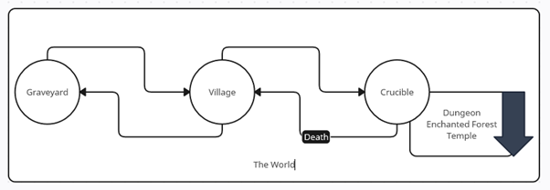
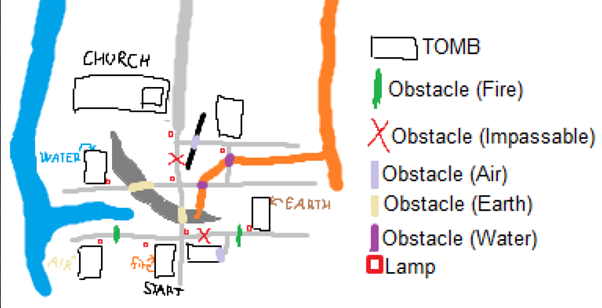
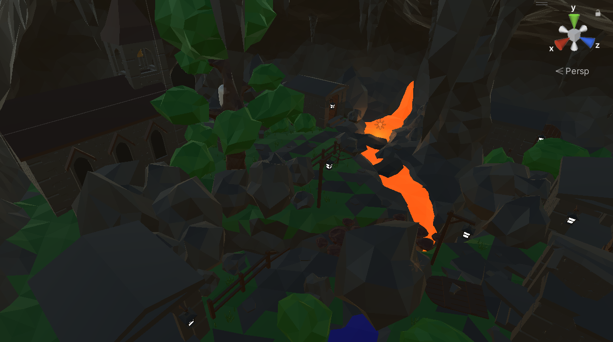
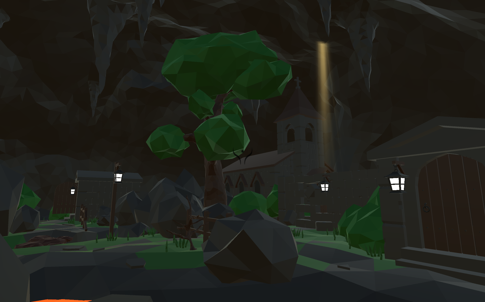
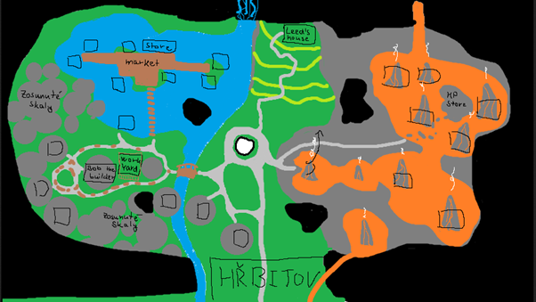
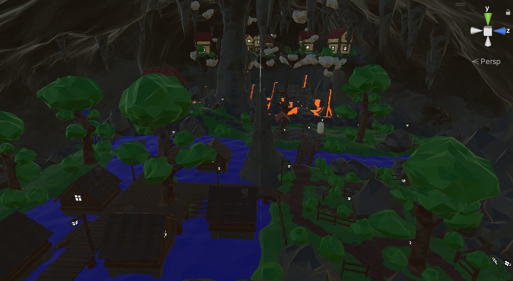
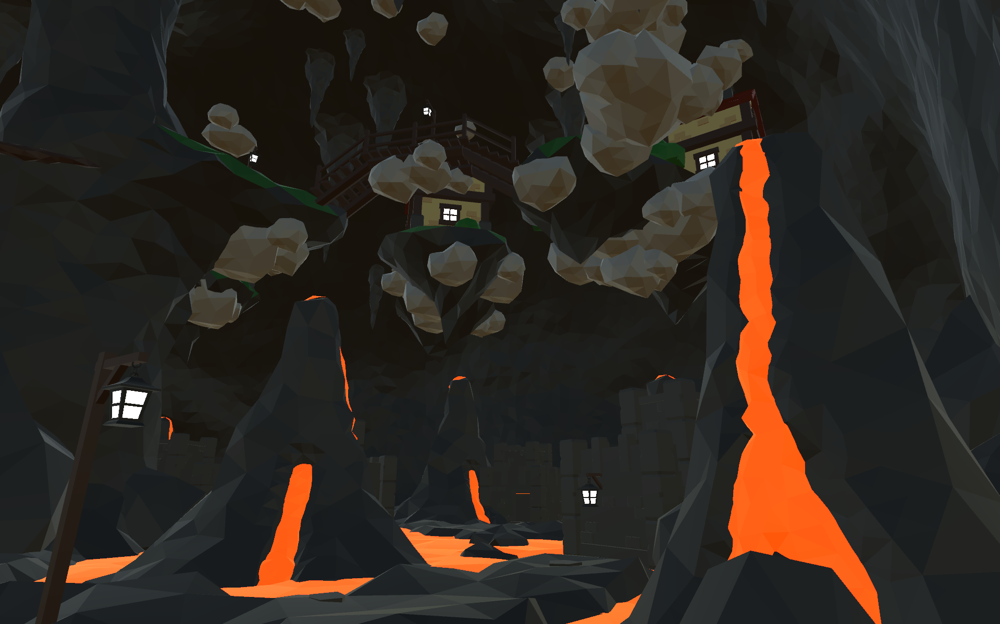
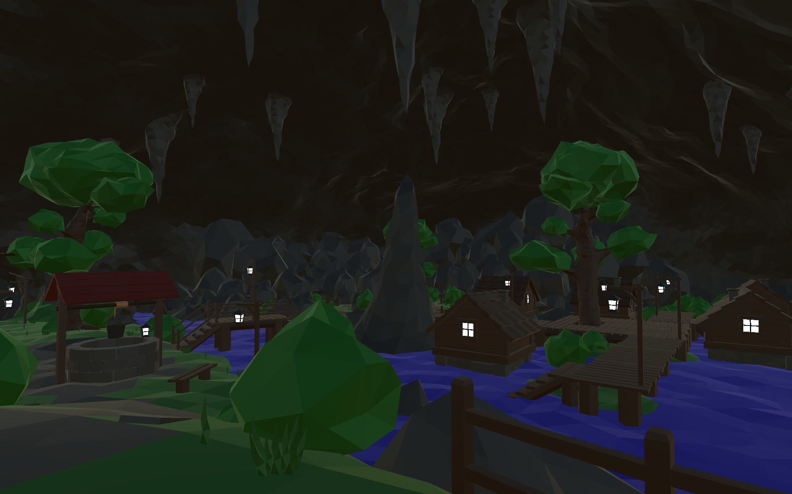
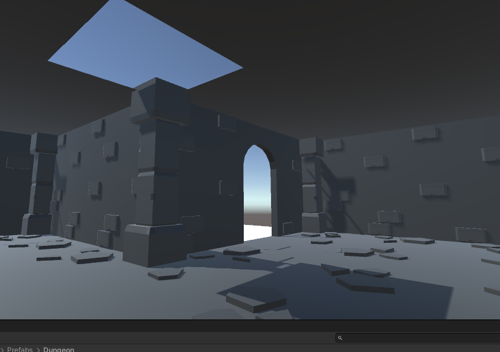

# Scény

 

 Svět hry se skládá ze 3 důležitých scén a to z Graveyard(Hřbitov, aka Tutoriál), Village(Vesnice) a Crucible. 
 
 Přecházení mezi scénami je často doslovné - hráč fyzicky přejde ze Hřbitova do Vesnice, či z Vesnice do Crucible. 
 Celá hra se odehrává v podzemí, přestože Crucible i Vesnice, jakožto magické prostory, si často hrají s konceptem co vlastně je “podzemí”.
 Další úžasná vlastnost světa je, že se zde nedá zemřít násilnou smrtí. Taková smrt vede pouze k zmrtvýchvstání ve Vesnici. 

## Graveyard/Hřbitov (Tutoriál)
 Opuštěný hřbitov Vesnice, nacházející se ve velké jeskyni. Místo, kde hlavní protagonista propadne do světa.

 Místo je první seznámení hráče s hlavními mechanikami, tedy pohybem, sesíláním kouzel, deníkem předchozího nešťastníka a se světem, ve kterém se ocitl. Hřbitov je očividně zchátralý a dobře připravuje hráče na Vesnici.
 Celé místo je tedy od počátku navrženo s myšlenkou přinutit hráče postupně využít hlavní mechaniky a pozvednout několik otázek, především “Kde to jsem?” a “Jak se odsud dostanu?”

[Návrh/Mapa tutoriálu]

Hlavní struktura navádějící hráče sbírat krystaly a využít je.

## Village/Vesnice
 
 Místo, ve kterém žili (a znovu budou žít) zdejší obyvatelé(Meenes), ve velké jeskyni s jezerem vody a lávy. Přímo ve středu se nachází vstup do Crucible, jako kdyby se celá vesnice rozrostla od něho, ale přesto si udržuje odstup a respekt. 

 Vesnice, a její obyvatelé je rozdělena na kvadranty, odpovídající živlu obyvatel, kteří jej obývají.  Jediná výjimka z pravidla je hlava, či starosta Vesnice - Old Man Leede a jeho dům. Jakožto Meene, který velikostně odpovídá hráči a neodpovídá žádnému ze 4 živlů běžných Meenes, je jeho obydlí mimo kvadranty.

[Prvotní náčrt/concept art vesnice]

 Při první návštěvě Vesnice je téměř opuštěná. Domy jsou rozpadlé, ticho vládne celému prostoru, kromě samotný

## Crucible

 I zde pokračuje spojující nit opuštěných míst. Crucible kdysi jistě mělo důvod existovat, ať už jako místo, kde byli mladí hrdinové testování Bohy, nebo hlubší vrstvy světa, které jejich původní obyvatelé postupně opustili. 
 
 Každá expedice do hloubek Crucible je unikátní, díky náhodné generaci, kde se místo samo rozhoduje, jaké překážky před protagonistu postavit.
 V hloubce, kdesi skrz mnoho monster a překážek, určitě existuje cesta ven z toho světa, zpět domů.

Crucible je rozdělen do několika vrstev. Dungeon je jistý, Enchanted Forest a Temple budou existovat, dá-li bůh.

1. Dungeon
    - První vrstva Crucible, ve tvaru a vizáži opuštěného žaláře, hradních chodeb a místností, i jeskyňí. 

 
 
2. Enchanted Forest
3. Temple
