# Assignment 1

## Material
- I picked stone-ish tiles from floor at MFF and to make it more interesting I changed the grid to hexagon
- It happened to bemore complex than I thought, because of its randomness for each tile

#### Work sequence
- I did the material first in Blender 5 than reimplemented the nodes from blender in glsl
    - I modeled the hexagon grid,
    - made noisy pattern randomised on each tile,
    - colored the tiles,
    - made material imperfections like many white dents, bigger black stains, non-unifom base color

|  |  |  |
| :---: | :---: | :---: |
| 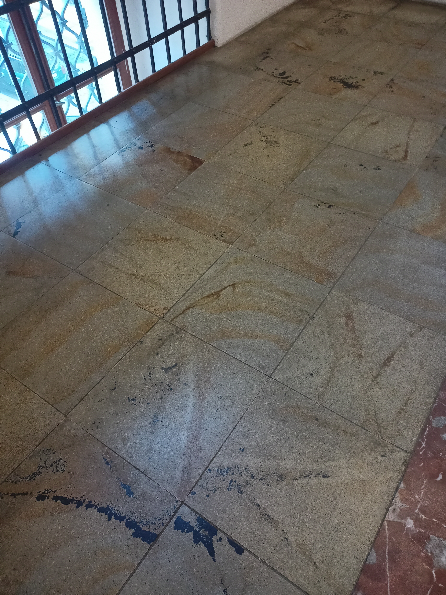 | 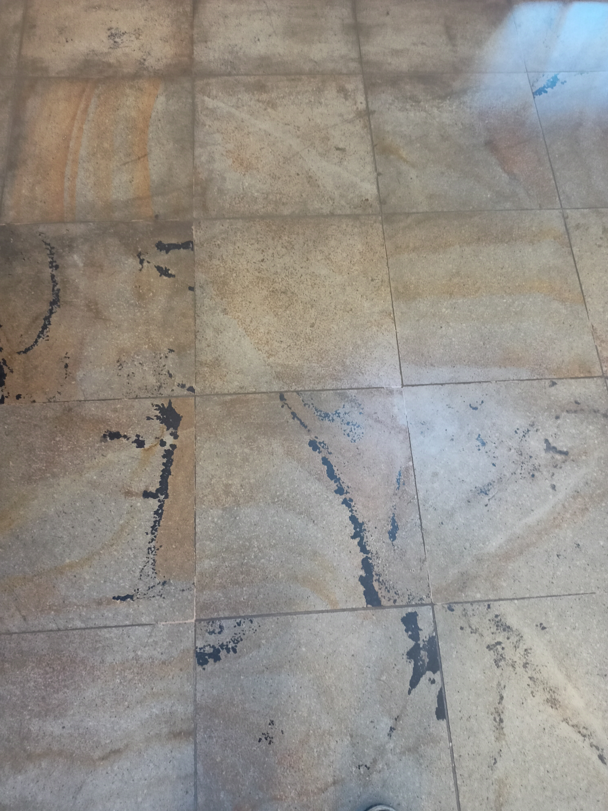 | 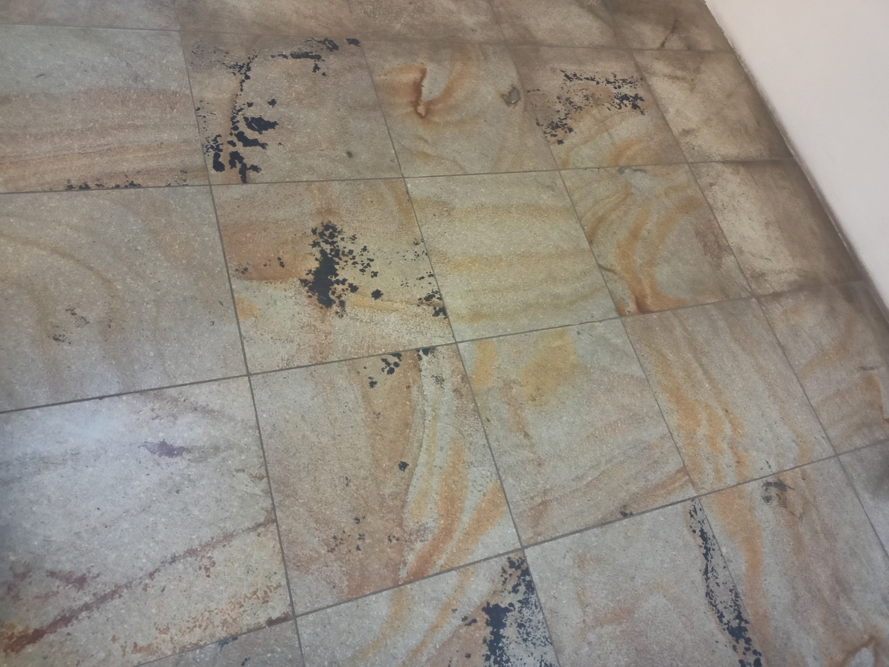 |
| 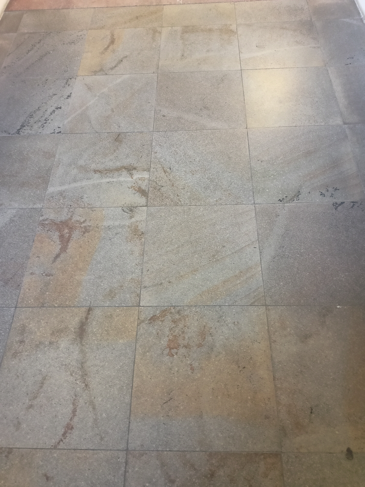 | 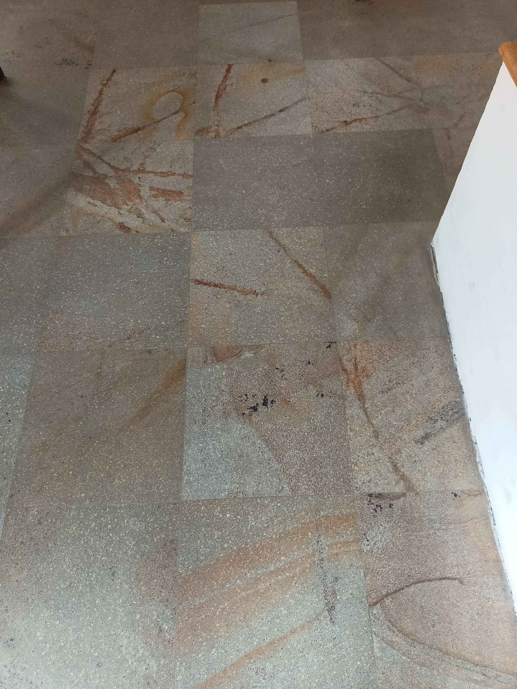 |  |

## Blender
- To make the hexagonal grid I used one from this video: https://youtu.be/mLRqhcPIjg8?si=EVA_B5ePt9J88hLn

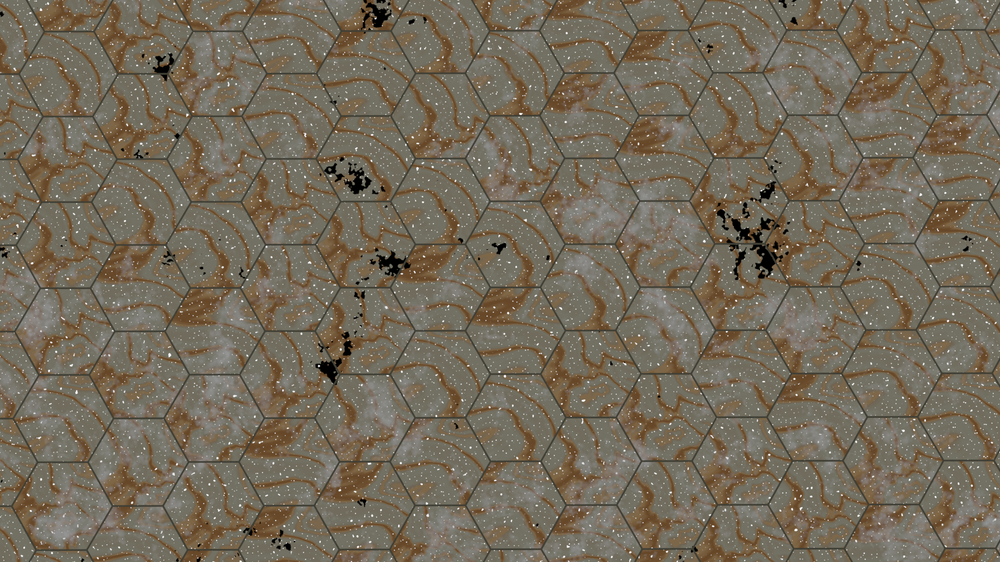

|  |  |
| :---: | :---: | 
| 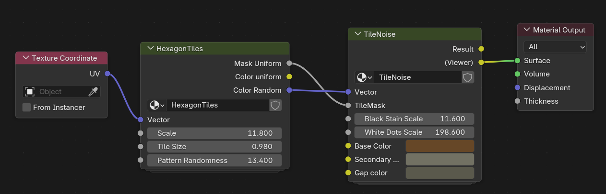 | 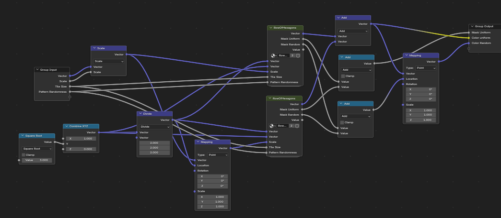 | 
|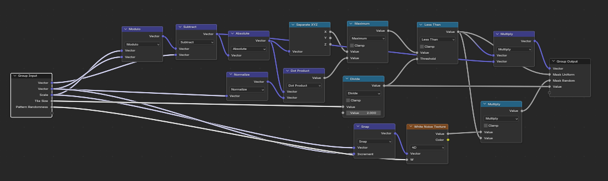 | 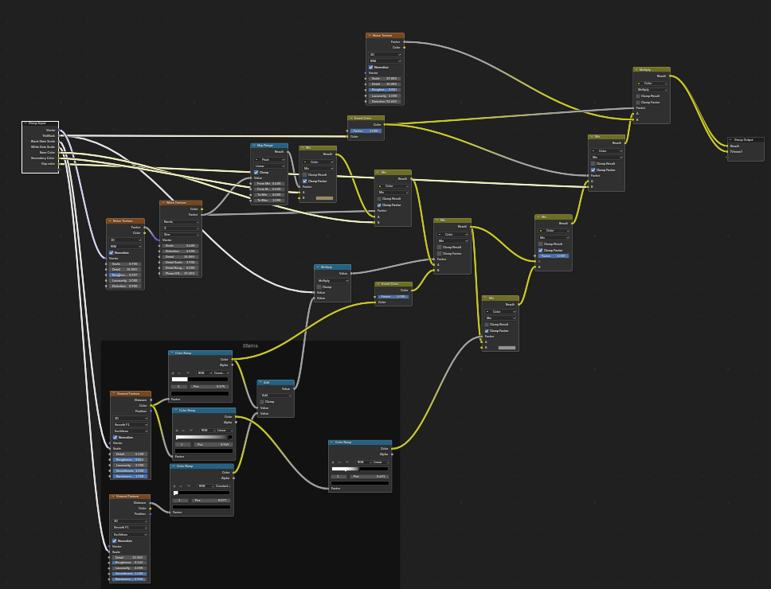 | 

## Three
- There I made it excatly like in blender
- To implement the nodes I used glsl blender src code: https://github.com/blender/blender/tree/main/source/blender/gpu/shaders/material and gave it to Gemini Pro to find all subfunction, which I could't find

**DOESNT WORK JUST BY OPENING HTML (blocked by CORS policy), because I made separate file for fragment shader**

**PLEASE OPEN IT WITH LIVE SERVER IN VS CODE**

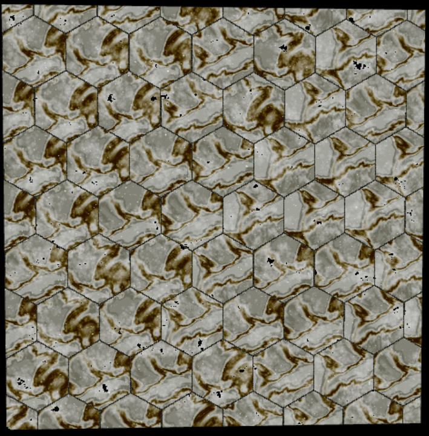
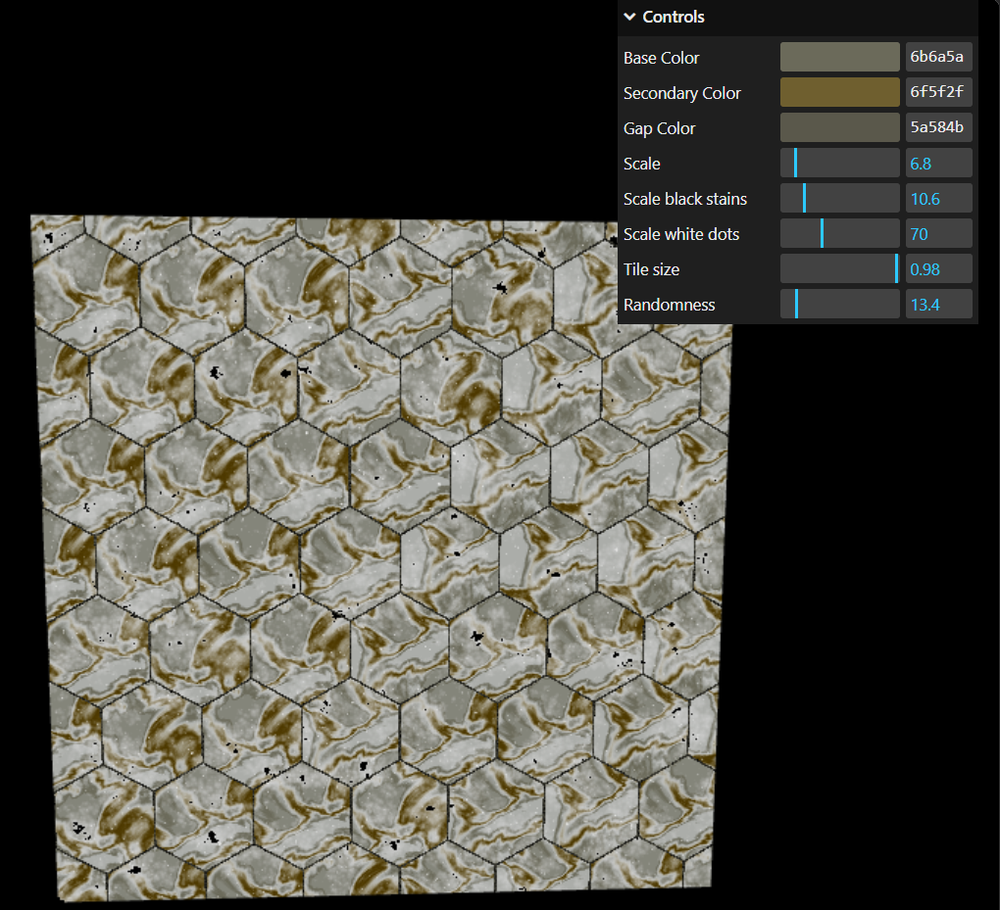
