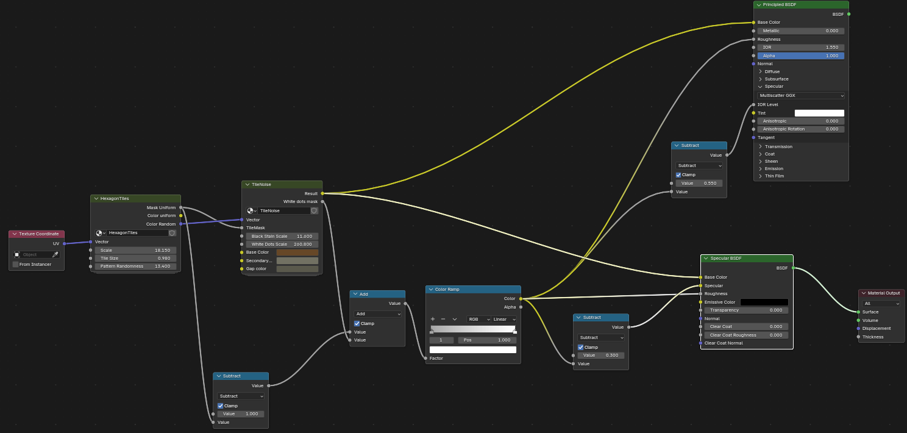
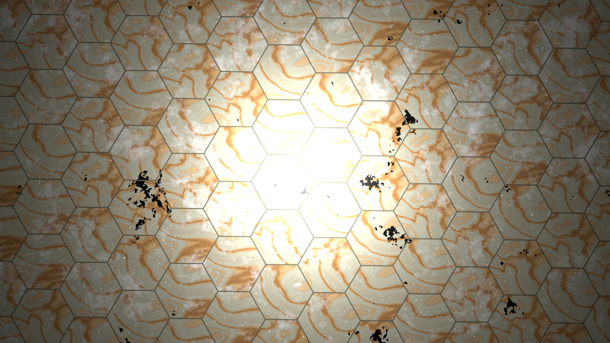
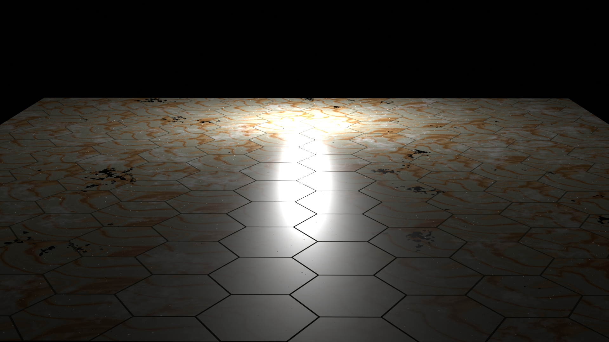
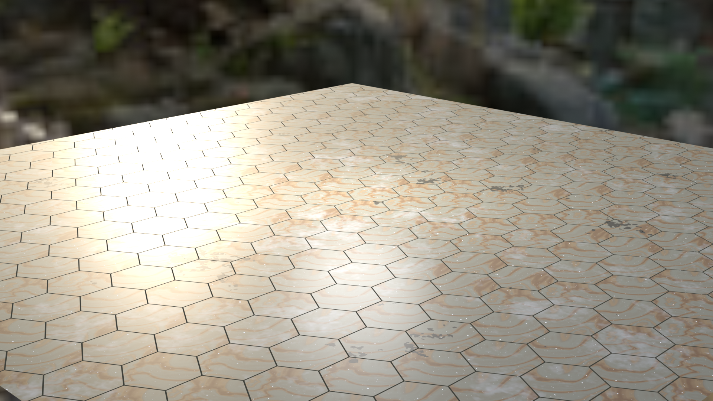
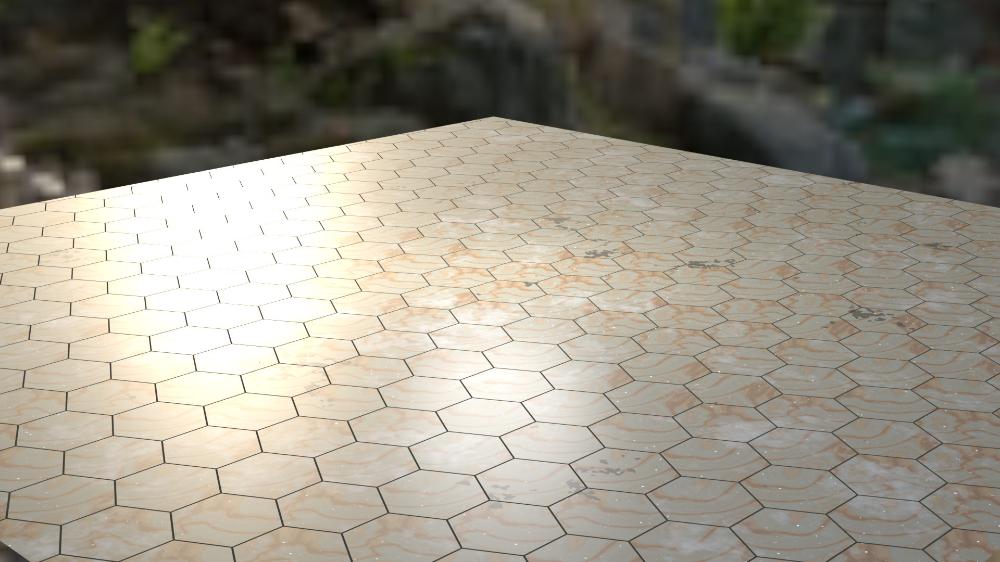
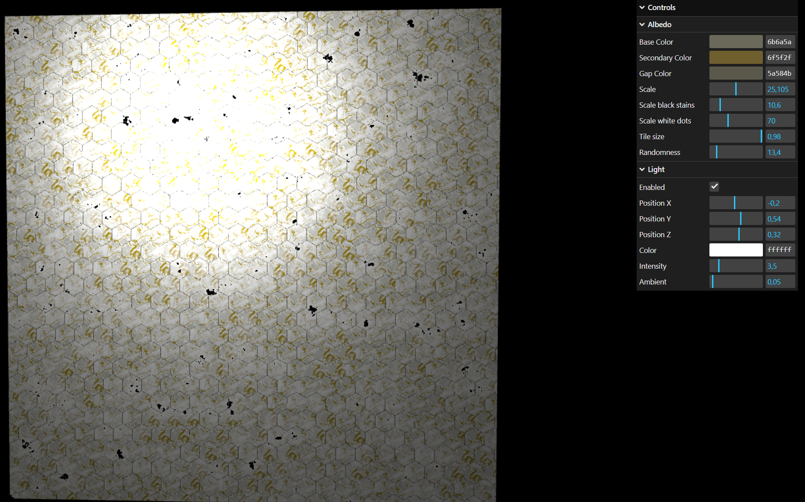
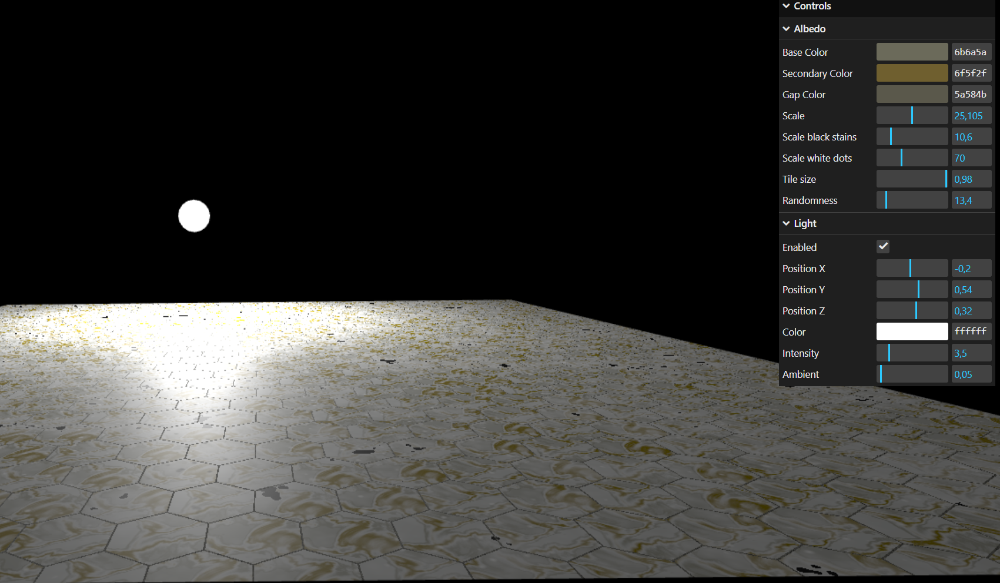
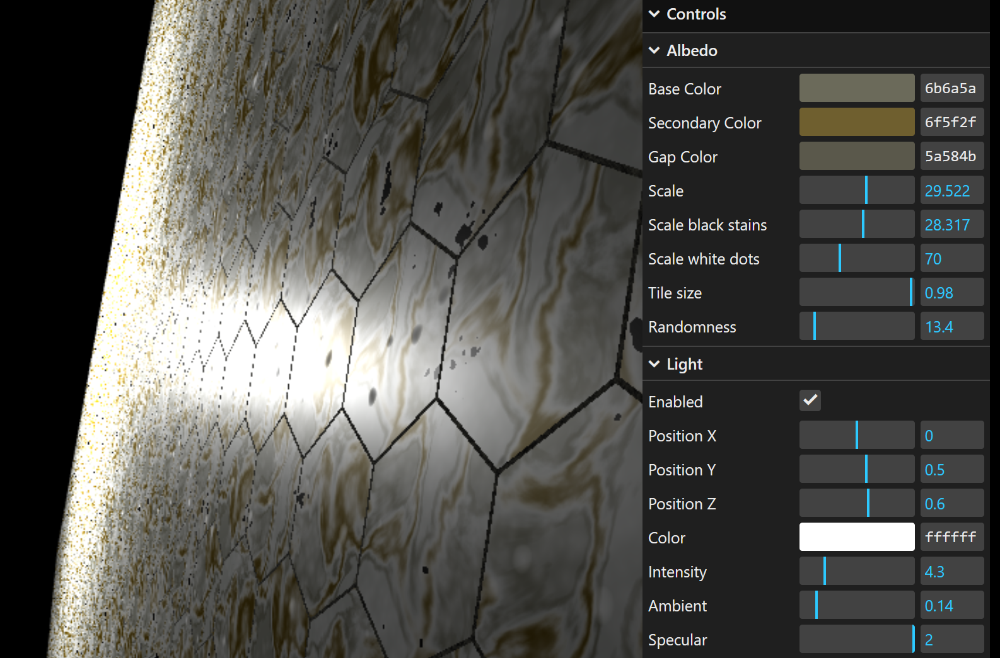

# Assignment 2

## Material

- Same as in previous task

## Blender

- Subtracted the hexagon grid mask from 1.0 so that I get opposite values
- I combined this mask with white dot mask to separate whole rough part from the smooth tiles
- Used color ramp to change black parts to light gray not to be so reflective
- This gave me roughness map, where the rough part is white and the tiles are light gray — reflective
- To make specular map I just subtracted roughness from value(0.2-1.0) to make it nicely specular
- I like Cycles better so I made both render options to compare result (adjusted both subtractions to look similar)

| EEVEE TOP | EEVEE SIDE|
|-|-|
|| |

| EEVEE SpecBSDF| CYCLES PrincBSDF |
|-|-|
|| |

## Three.js

- Everything like in Blender -> albedo, roughness, specular
    - vec3 f_diff = albedo / PI;
    - For parameter alpha = roughness^2;
    - Specular map is multiplied with IOR to make F0 in Fresnel term
- For the Microfacet BRDF
    - For F - Schlick's approximation
    - For G - I implemented Smith GGX and Schlick GGX approximation - Schlick is used
    - For D - GGX formula 
    - (src: https://graphicrants.blogspot.com/search?q=specular+brdf)
    

**DOESNT WORK JUST BY OPENING HTML (blocked by CORS policy), because I made separate file for fragment shader**

**PLEASE OPEN IT WITH LIVE SERVER IN VS CODE**

- Added parameter to adjust specularity

