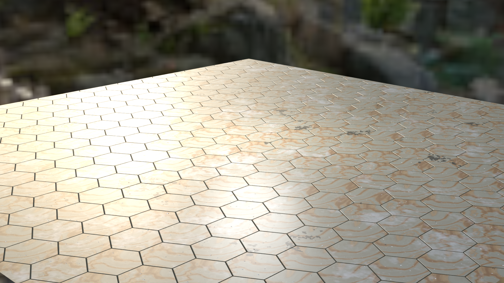
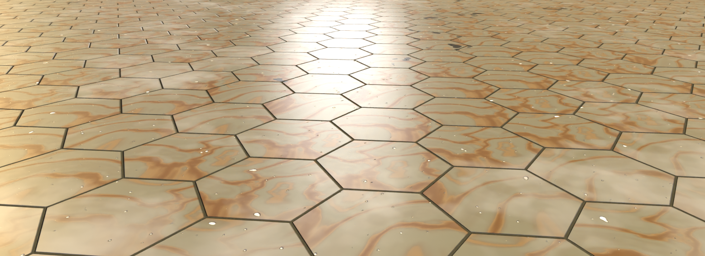
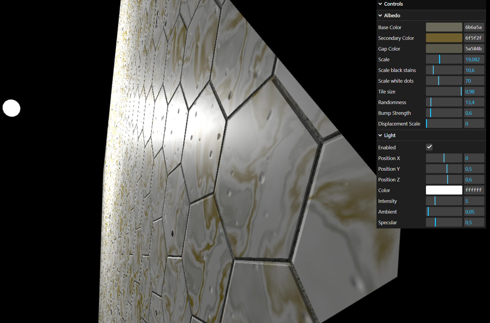
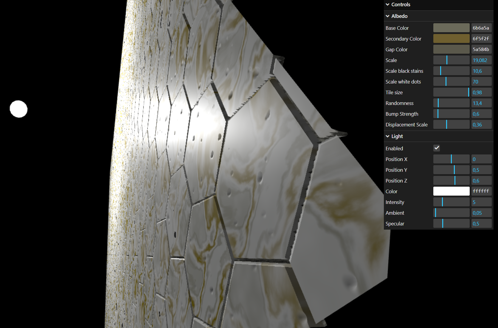

# Assignment 3

## Material

- Same as in previous task

## Blender

- In this task I just took an output from add(hexagon mask, white dots mask) a plugged it into Bump node
- Bump node set to Invert input and distance to 10cm, because 1cm was not so visible
- Bump node plugged into normal input of Principled BSDF





## Three.js

**DOESNT WORK JUST BY OPENING HTML (blocked by CORS policy), because I made separate file for fragment shader**

**PLEASE OPEN IT WITH LIVE SERVER IN VS CODE**

#### Normals

- I took height map from the masks like in Blender
- I took the tangent from the VS and re-ortonormalize it
- Computed bitangent by cross product
- I had to make separate function to get height data from neigboring fragments in distance **dst** to right and up
- From these values calculated finite derivative in x and y / u and v
- New normal came from modulation by derivatives and multiplication by TBN matrix

```C++
// ---- Bump mapping 
vec3  N       = normalize(vWorldNormal);
vec3  T       = normalize(vWorldTangent.xyz);

T = normalize(T - dot(T, N) * N);
vec3 B = normalize(cross(N, T) * vWorldTangent.w);

float dst = 1.0 / 1024.0;
float R = getNeighbor(vUv + vec2(dst, 0.0)); 
float U = getNeighbor(vUv + vec2(0.0, dst)); 
float dU = (R - heigh_map);
float dV = (U - heigh_map);

mat3 TBN = mat3(T, B, N);

vec3 localNormal = normalize(vec3(-dU * bumpStrength, -dV * bumpStrength, 1.0));

vec3 pN = normalize(TBN * localNormal);
```



#### Displacement

- First I just divided the plane into at least 1k x 1k vertices 
- I modulated position of each vertex in VS:
    - I moved the position in normal direction
    - Normal size is based on height map - where to displace
    - Normal size is based on displacement - how far to displace
    - divided by constant, which set it to suitable range
    
```C++
vec3 displacement = position + normal * height * displacementScale / 64.0;
vec4 worldPosition = modelMatrix * vec4(displacement, 1.0);
```



