# Assignment 4

## Material and GAN output

- Other than in previous task - figured wooden board - unfortunately GAN didn't catch the figure
- I tried to process six sets of nine photos, but most of them became useless. Like this one where the black flecks appear in the roughness and specular map (latent2_1024):
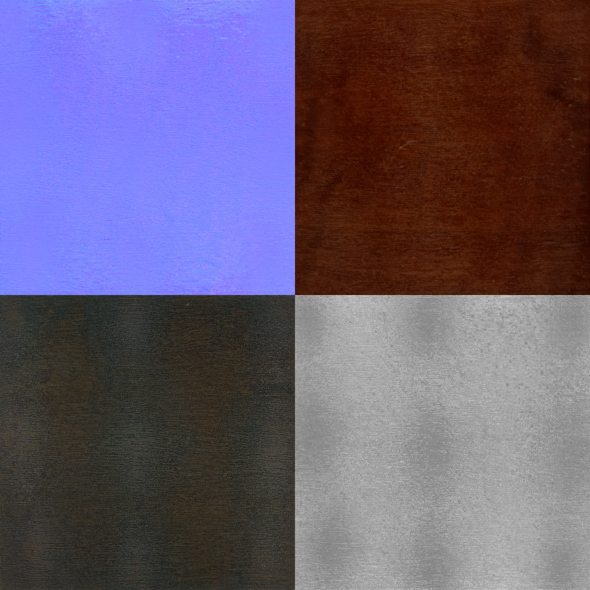
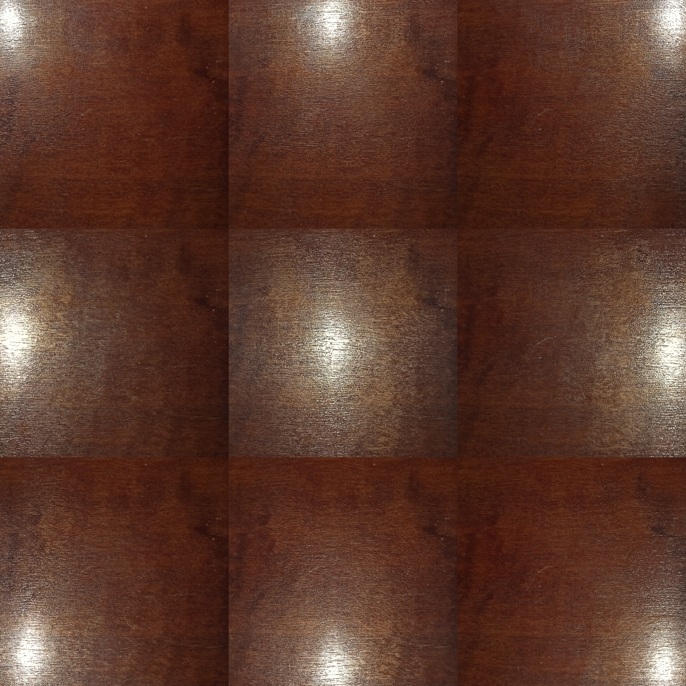
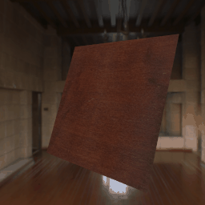

### The best one I have gotten (latent1_1024):
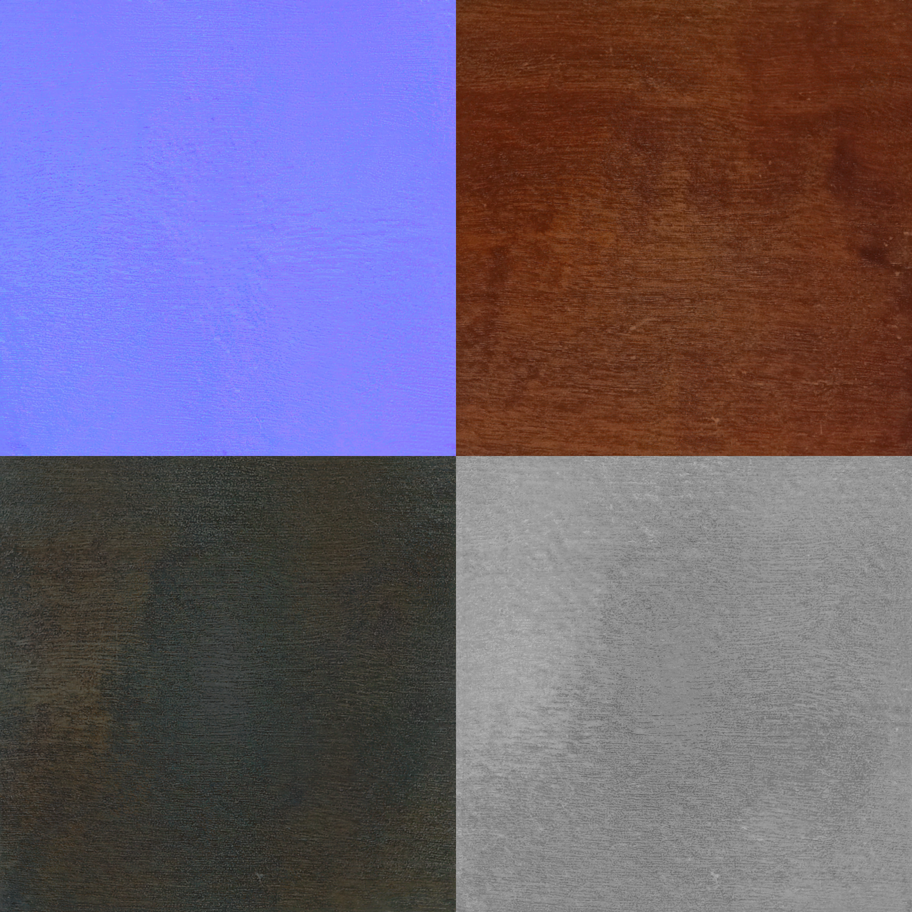
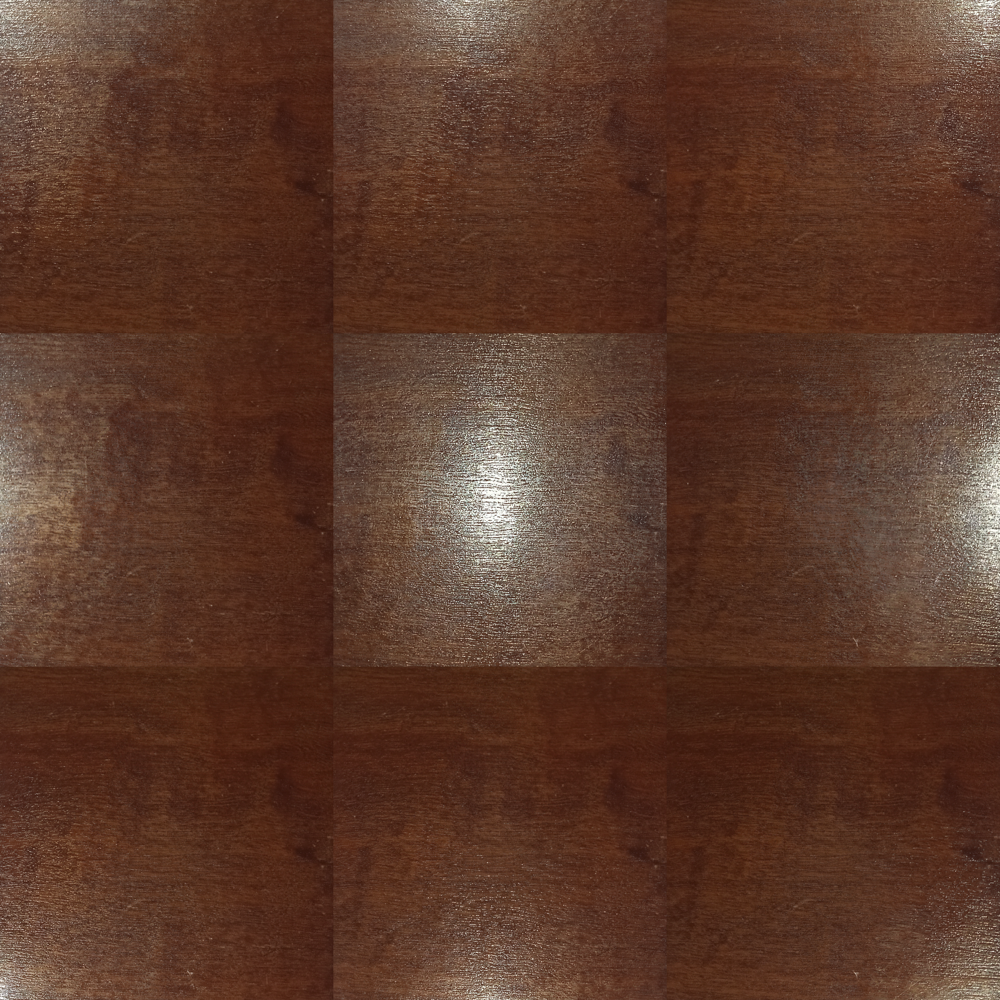
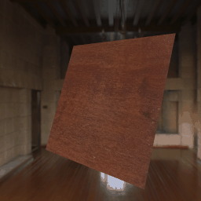

## Blender

- All textures plugged into Principled BSDF

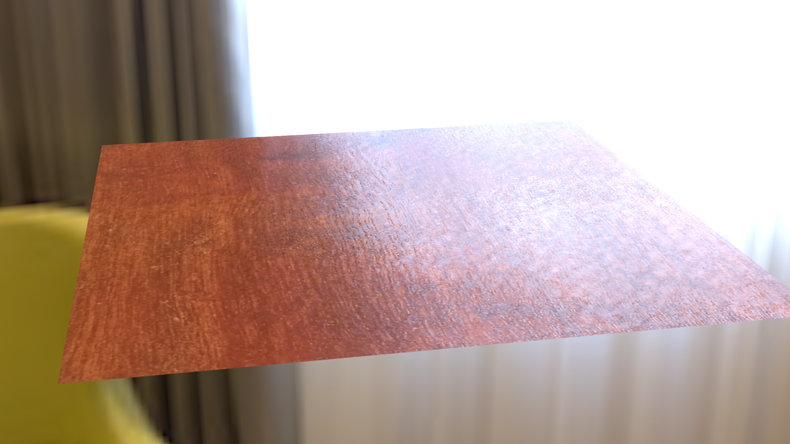
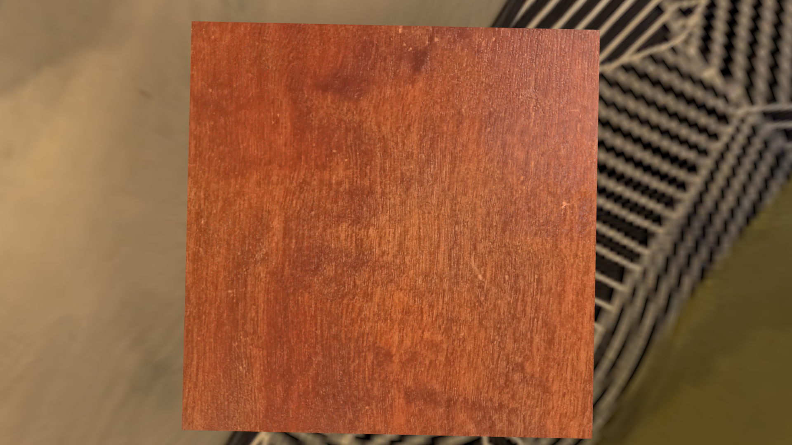

## Three.js

**DOESNT WORK JUST BY OPENING HTML (blocked by CORS policy), because I made separate file for fragment shader**

**PLEASE OPEN IT WITH LIVE SERVER IN VS CODE**

- I used last three.js code so I had to remove many functions
- All textures are uniforms loaded as texture(map, uv) and used like:
    - f_diff = diffuseMap / PI
    - new_normal = TBN * normalMap
    - schlick_approx(VdotH, IOR, specularMap)
    - float D = NDF_GGX_D(roughnessMap, NdotH);
    - float k = (roughnessMap + 1.0) * (roughnessMap + 1.0) / 8.0;

### Firstly I opened that worse texture results:
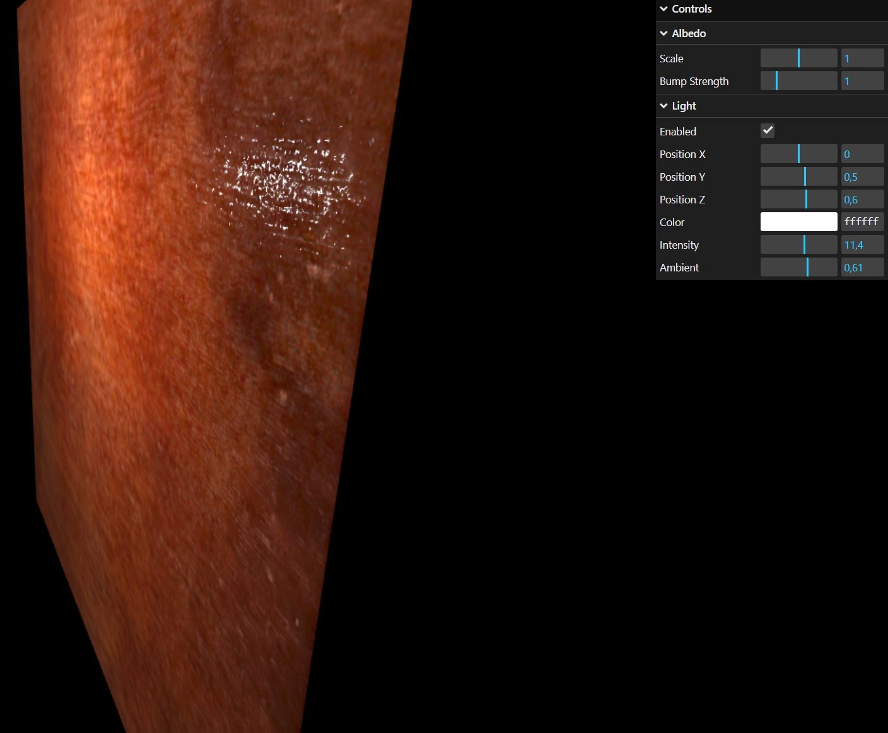
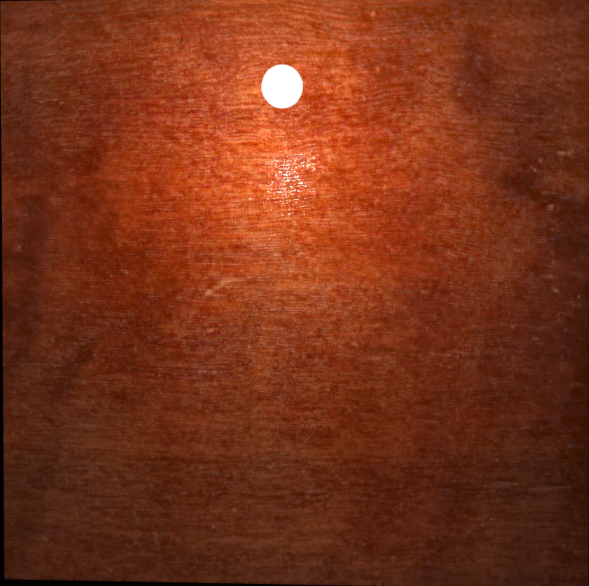

### Then the better ones:
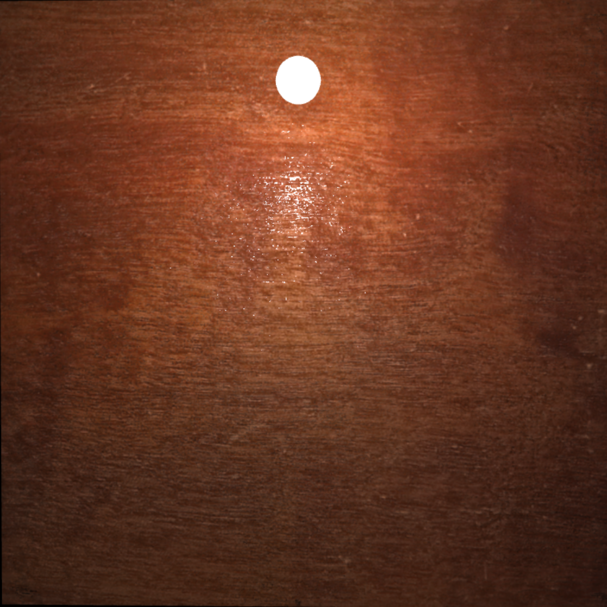
