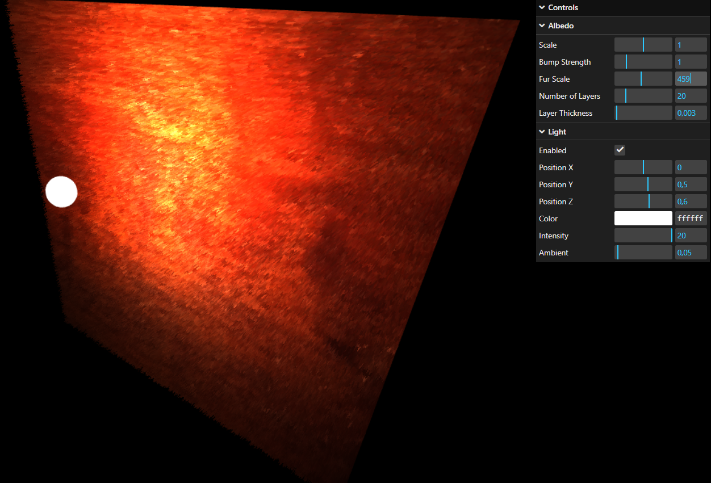
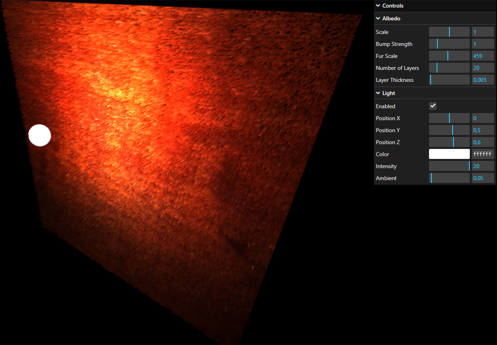
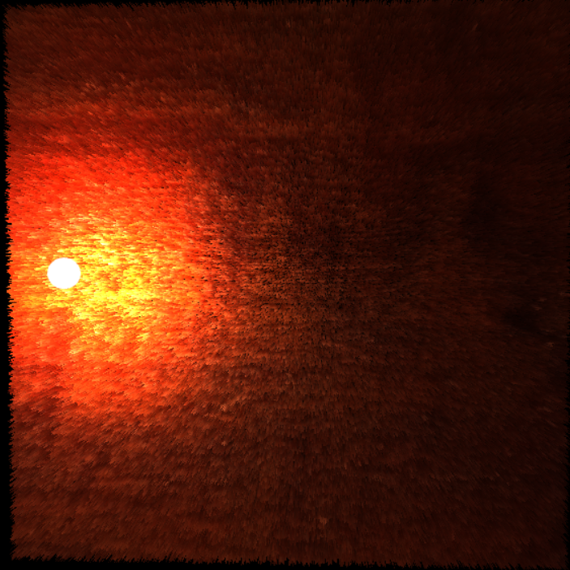
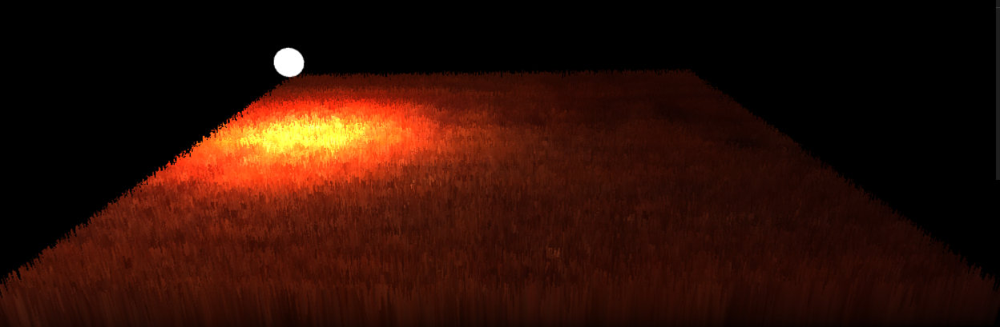
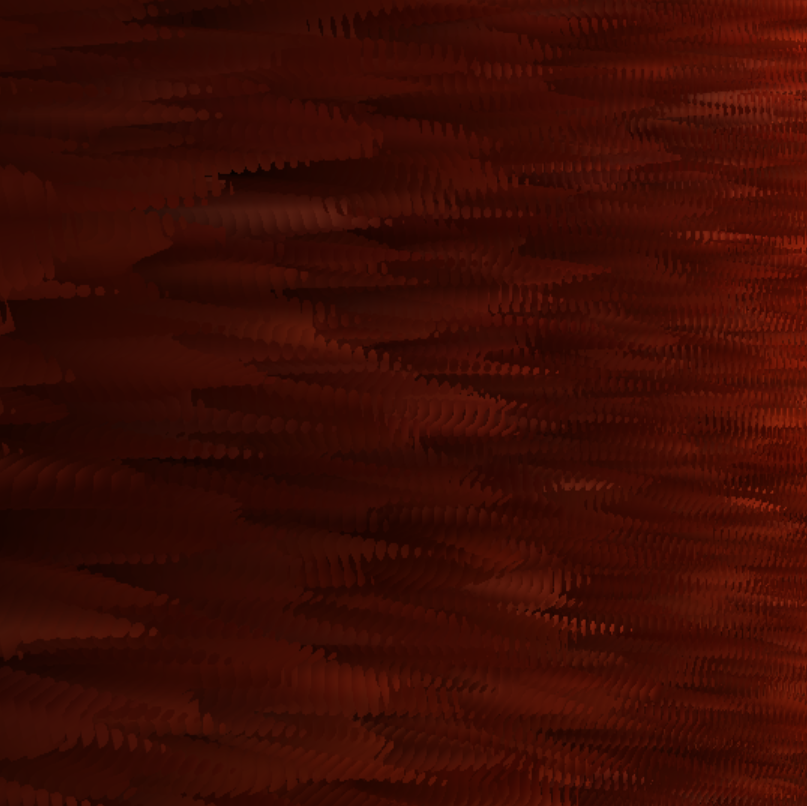

# Assignment 5

## Fur using shell texture

Vertex shader
- following the task and setting current layer as out parameter
```C++
float currentLayerDistance = float(gl_InstanceID) * uLayerThickness;
vLayer = float(gl_InstanceID) / float(uNumberOfLayers);

vec3 offsetPosition = position + normal * currentLayerDistance;
vec4 worldPosition = modelMatrix * vec4(offsetPosition, 1.0);
```

Fragment shader
- I used diffuse BRDF on the diffuse texture from GAN
- valuesNoise was generated by AI

```C++
vec2 Uv = scale*vUv;
vec2 furUv = furScale*vUv;
vec3 albedo = texture(diffuseMap, Uv).rgb;
// clip negative values and stretch the interval
float furNoise = (valueNoise(furUv)-0.2)*1.25;

if(vLayer > 0.0)
{   // discard more values in higher layers
    if(furNoise < vLayer)
        discard;
}
// The color darkens like sqrt in lower layers
float selfShadow = mix(0.1, 1.0, pow(vLayer, 0.5));
```
### Without self-shadowing



### With self-shadowing





### Layers
